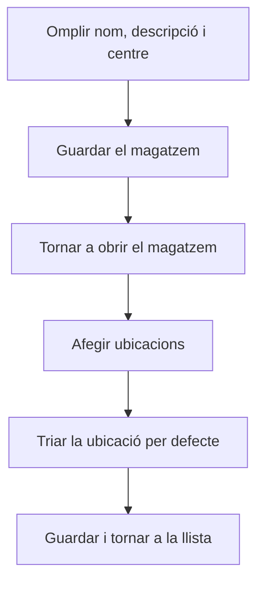

# Magatzem

## Per a que serveix aquesta pantalla

És la fitxa d'un magatzem. A dalt hi ha les dades del magatzem (nom, descripció, centre, ubicació per defecte i si està desactivat) i a sota, la taula «Ubicacions», on es creen i es mantenen les ubicacions on es guarda l'estoc. Quan es crea un magatzem, el títol és «Alta de magatzem»; quan se n'edita un, «Magatzem» seguit del nom. La llista de tots els magatzems és a «Gestió de magatzems».

## Accions disponibles

- Editar el «Nom», la «Descripció», el «Centre», la «Ubicació per defecte» i la casella «Desactivat», i desar-ho amb «Guardar», a la capçalera.
- Afegir una ubicació amb el botó + de la taula «Ubicacions». S'obre el diàleg «Crear ubicació».
- Editar una ubicació fent clic a la seva fila (diàleg «Actualitzar ubicació»).
- Eliminar una ubicació amb la creu de la fila i confirmar el missatge «Segur que vols eliminar la ubicació...?».
- Filtrar les ubicacions per tipus amb el desplegable «Tots els tipus».

## Flux habitual

1. Des de «Gestió de magatzems», prem «Nou» (+) per obrir «Alta de magatzem».
2. Omple el «Nom», la «Descripció» i el «Centre» i prem «Guardar».
3. Torna a la llista i obre el magatzem nou.
4. Prem + a «Ubicacions», omple el «Nom», la «Descripció» i, si cal, la «Tipologia», i prem «Guardar». Repeteix-ho per a cada ubicació.
5. Tria la «Ubicació per defecte» entre les ubicacions creades i prem «Guardar» a la capçalera. La pantalla torna a la llista.

## Aspectes importants

- El «Nom», la «Descripció» i el «Centre» són obligatoris. La «Tipologia» de la ubicació és opcional: «Subministrament», «Recepció», «Expedició» o «Emmagatzematge».
- Per desar un magatzem que ja existeix, cal haver triat una «Ubicació per defecte». En crear-lo encara no en té, perquè les ubicacions s'afegeixen després.
- El desplegable «Ubicació per defecte» només ofereix les ubicacions d'aquest magatzem.
- Les ubicacions es desen al moment, en prémer «Guardar» al seu diàleg, sense haver de desar la fitxa del magatzem.
- La ubicació per defecte és on el sistema deixa les entrades i sortides automàtiques (recepcions de compra, albarans de venda, producció de les ordres de fabricació i retalls que tornen de les màquines). El sistema la pren d'un magatzem actiu.
- No es pot eliminar la ubicació que és la ubicació per defecte del magatzem: primer cal triar-ne una altra.
- Les ubicacions «APR-» més el nom d'una màquina, de tipus «Subministrament», les crea el sistema en crear la màquina. Si la màquina es desactiva o s'elimina, la seva ubicació també, tret que tingui estoc o moviments: llavors es conserva.
- Una ubicació o un magatzem marcats com a «Desactivat» deixen de mostrar el seu estoc a «Estocs» i a «Inventari» i no surten als desplegables d'ubicació.
- Eliminar una ubicació és definitiu, i no es pot eliminar una ubicació que tingui estoc o moviments de magatzem. Si ja s'ha fet servir, marca-la com a «Desactivat».

## Errors frequents

- Si en desar surt l'avís «Selecciona una ubicació per defecte», tria-la al camp «Ubicació per defecte». Si la llista és buida, crea primer alguna ubicació.
- Si en eliminar una ubicació surt «Ubicació amb dependències», és la ubicació per defecte (tria'n una altra, desa i torna-ho a provar) o té estoc o moviments (marca-la com a «Desactivat»).
- Si una ubicació nova no apareix a la taula després de desar-la, comprova primer que no n'hi hagi cap altra amb el mateix nom en aquest magatzem.
- Si un magatzem nou no es desa, comprova que no existeixi ja un magatzem amb el mateix nom i que el nom no passi de 50 caràcters.

## Proces basic

```mermaid
flowchart TD
    A[Omplir nom, descripció i centre] --> B[Guardar el magatzem]
    B --> C[Tornar a obrir el magatzem]
    C --> D[Afegir ubicacions]
    D --> E[Triar la ubicació per defecte]
    E --> F[Guardar i tornar a la llista]
```
