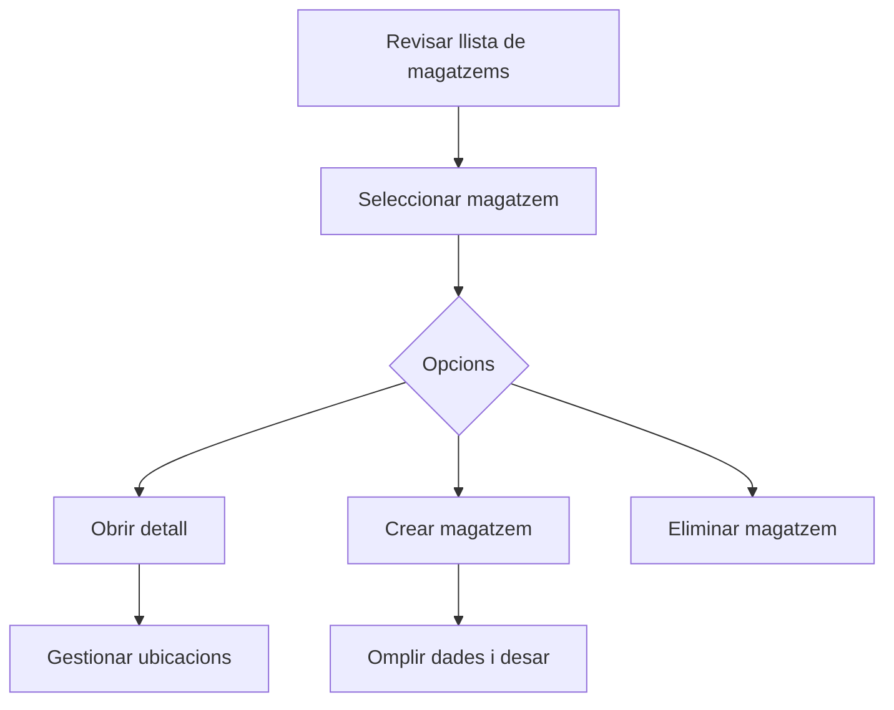

# Magatzems

## Per a que serveix aquesta pantalla

La pantalla de magatzems permet consultar i gestionar el directori de magatzems de l'empresa. Cada magatzem pot contenir múltiples ubicacions (zones d'emmagatzematge, subministraments, recepció, expedició) que organitzen les existències.

## Accions disponibles

- Crear un magatzem nou
- Obrir el detall d'un magatzem existent
- Eliminar un magatzem
- Consultar si un magatzem està activat o desactivat

## Flux habitual

1. Revisa la llista de magatzems existents.
2. Selecciona un magatzem per obrir el seu detall.
3. Gestiona les ubicacions associades des del detall.
4. Crea nous magatzems si cal.

## Aspectes importants

- Un magatzem desactivat romandrà visible a la llista però no podrà rebre noves operacions.
- Les accions d'eliminació poden estar blocades si el magatzem té ubicacions amb existències associades.
- Cada magatzem pot tenir múltiples ubicacions (zones) gestionades des del seu detall.

## Errors frequents

- Si no es mostra cap magatzem, comprova que la connexió amb el servidor sigui correcta.
- Si no es pot eliminar un magatzem, verifica que no tingui ubicacions amb existències vinculades.

## Proces basic

