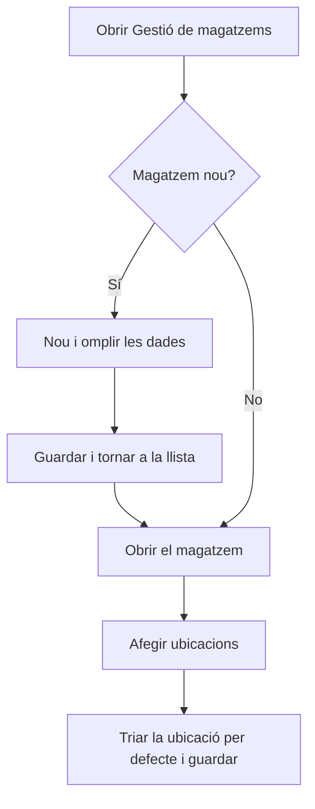

# Gestió de magatzems

## Per a que serveix aquesta pantalla

Llista els magatzems de l'empresa. Cada magatzem pertany a un centre i té ubicacions, que és on es guarda l'estoc de cada referència. Des d'aquí es crea un magatzem nou, s'obre un magatzem per configurar-ne les ubicacions i la ubicació per defecte, o se n'elimina un. L'estoc que es guarda en aquests magatzems es consulta a «Estocs», i el seu historial a «Moviments de magatzem».

## Accions disponibles

- Crear un magatzem amb el botó «Nou» (+). S'obre la pantalla «Alta de magatzem».
- Obrir un magatzem fent clic a la seva fila per editar-ne les dades i les ubicacions.
- Eliminar un magatzem amb la paperera de la fila («Eliminar») i confirmar el missatge «Segur que vols eliminar el magatzem...?».
- Consultar el «Nom», la «Descripció» i si està «Desactivat».

## Flux habitual

1. Prem «Nou» (+) per donar d'alta un magatzem.
2. Omple el «Nom», la «Descripció» i el «Centre» i prem «Guardar».
3. Torna a la llista i obre el magatzem que acabes de crear.
4. Afegeix-hi les ubicacions a la taula «Ubicacions».
5. Tria la «Ubicació per defecte» i prem «Guardar».

## Aspectes importants

- La «Ubicació per defecte» és on el sistema deixa les entrades i sortides automàtiques quan no s'indica cap altra ubicació: recepcions de compra, albarans de venda, producció de les ordres de fabricació i retalls que tornen de les màquines. El sistema la pren d'un magatzem actiu (no desactivat).
- Un magatzem desactivat es continua veient en aquesta llista, però el seu estoc deixa de sortir a «Estocs» i a «Inventari» i les seves ubicacions no apareixen als desplegables d'ubicació.
- Quan es crea una màquina, el sistema crea automàticament una ubicació de tipus «Subministrament» anomenada «APR-» més el nom de la màquina en un magatzem actiu. És on va el material que s'aprovisiona a la màquina.
- L'eliminació és definitiva i també elimina les ubicacions del magatzem. No es pot eliminar un magatzem si alguna ubicació té estoc o moviments de magatzem; en aquest cas, marca'l com a «Desactivat».

## Errors frequents

- Si surt «No s'ha pogut eliminar el magatzem ...», alguna ubicació té estoc o moviments: marca'l com a «Desactivat».
- Si una recepció, un albarà o el final d'una ordre de fabricació falla amb «No hi ha una ubicació per defecte definida al projecte», obre el magatzem actiu i tria-hi una «Ubicació per defecte».
- Si després de crear un magatzem no surt el missatge «Magatzem creat correctament», comprova primer que no n'hi hagi cap altre amb el mateix nom.
- Si l'estoc d'un magatzem ha desaparegut d'«Estocs», comprova que el magatzem o la ubicació no estiguin marcats com a «Desactivat».

## Proces basic

```mermaid
flowchart TD
    A[Obrir Gestió de magatzems] --> B{Magatzem nou?}
    B -->|Sí| C[Nou i omplir les dades]
    C --> D[Guardar i tornar a la llista]
    D --> E[Obrir el magatzem]
    B -->|No| E
    E --> F[Afegir ubicacions]
    F --> G[Triar la ubicació per defecte i guardar]
```
