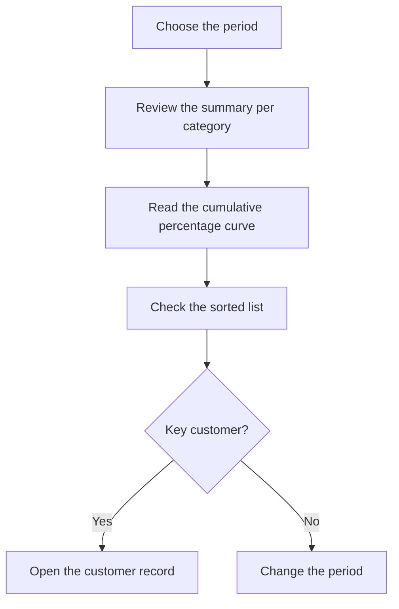

# ABC by customer

## What this screen is for

Classifies customers into three categories by the weight of their revenue in a period, following the Pareto principle: a few customers usually account for most of the sales. Use it to decide where to focus sales and service effort. It is based on the sales invoices of the period.

## Available actions

- Choose the "Period" with the date picker. It filters by the invoice date.
- Apply the filter with "Filter". Changing the period also reloads the data.
- Go back to the current year with "Clear".
- See the ABC curve on the "Chart" tab.
- Check the classification on the "Data" tab and sort it by customer, value or category.
- Open a customer's record by clicking its underlined name.

## Usual flow

1. Open the screen: it analyzes the current year.
2. On "Chart", read the summary at the top: how many customers fall into each category and what share of the value they represent.
3. See where the "Cumulative %" line reaches 80 % and 95 %: that marks where the A and B customers end.
4. Open "Data" to see the sorted list and each customer's category.
5. Click a customer to open its record if you want to review it.

## Important notes

- **"Value"**: sum of the totals of the customer's sales invoices dated within the period, including taxes and transport. Disabled invoices are not counted and corrective invoices subtract.
- Customers with a zero or negative value in the period are left out of the analysis.
- **"Rank"**: the customer's position from highest to lowest value.
- **"% value"**: the customer's share of the total of all customers in the analysis.
- **"Cumulative %"**: the sum of the "% value" of this customer and of every customer ranked above it.
- **"Category"**, based on the row's "Cumulative %":
  - **A** (red): up to 80 %. These are the main customers.
  - **B** (orange): above 80 % and up to 95 %.
  - **C** (green): the rest, above 95 %.
- The cumulative % includes the customer itself. That is why, if a single customer accounts for more than 80 % of the total, it is classified as B, not A.
- **Chart summary**: for each category it shows the number of customers and their percentage of all customers, and the value and its percentage of the total value.
- **Chart**: the bars are each customer's "Value", colored by category, read on the left axis. The blue line is the "Cumulative %", on the right axis from 0 to 100. With more than 40 customers the names on the horizontal axis are hidden; hover over a bar to see them.
- The "Code" and the name come from the customer data recorded on the invoices.
- The screen is read-only: it does not change any customer data.
- There is an equivalent analysis for suppliers, "ABC by supplier".

## Common errors

- If a customer is missing, check that it has sales invoices within the period that are not disabled and that its total is not zero or negative.
- If the chart shows "No data to display", the period has no sales invoices.
- If the data does not change after you pick a date, check that the period also has an end date.
- If a customer's value is lower than expected, check whether it has corrective invoices in the period.

## Basic process

