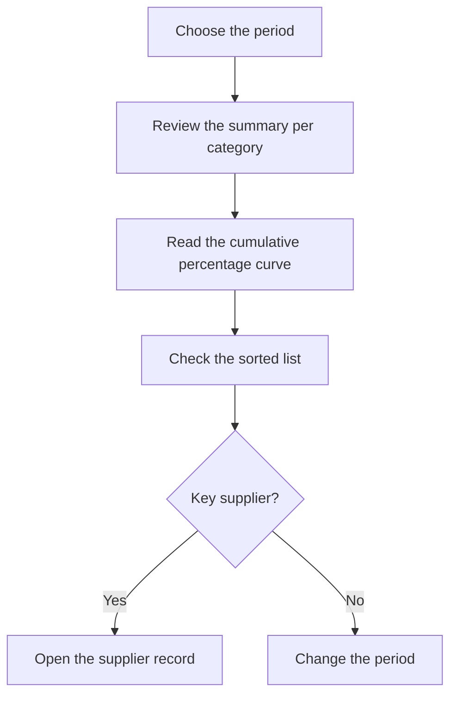

# ABC by supplier

## What this screen is for

Classifies suppliers into three categories by the weight of what was purchased from them in a period, following the Pareto principle: a few suppliers usually account for most of the purchasing spend. Use it to decide which suppliers to negotiate terms with or where to watch your dependency. It is based on the purchase invoices of the period.

## Available actions

- Choose the "Period" with the date picker. It filters by the purchase invoice date.
- Apply the filter with "Filter". Changing the period also reloads the data.
- Go back to the current year with "Clear".
- See the ABC curve on the "Chart" tab.
- Check the classification on the "Data" tab and sort it by supplier, value or category.
- Open a supplier's record by clicking its underlined name.

## Usual flow

1. Open the screen: it analyzes the current year.
2. On "Chart", read the summary at the top: how many suppliers fall into each category and what share of the value they represent.
3. See where the "Cumulative %" line reaches 80 % and 95 %: that marks where the A and B suppliers end.
4. Open "Data" to see the sorted list and each supplier's category.
5. Click a supplier to open its record if you want to review it.

## Important notes

- **"Value"**: sum of the totals of the supplier's purchase invoices whose invoice date falls within the period, including taxes and with discounts applied. Disabled invoices are not counted.
- Only purchase invoices count: the expenses in "Expense management" are not included.
- Suppliers with a zero or negative value in the period are left out of the analysis.
- **"Rank"**: the supplier's position from highest to lowest value.
- **"% value"**: the supplier's share of the total of all suppliers in the analysis.
- **"Cumulative %"**: the sum of the "% value" of this supplier and of every supplier ranked above it.
- **"Category"**, based on the row's "Cumulative %":
  - **A** (red): up to 80 %. These are the main suppliers.
  - **B** (orange): above 80 % and up to 95 %.
  - **C** (green): the rest, above 95 %.
- The cumulative % includes the supplier itself. That is why, if a single supplier accounts for more than 80 % of the total, it is classified as B, not A.
- **Chart summary**: for each category it shows the number of suppliers and their percentage of all suppliers, and the value and its percentage of the total value.
- **Chart**: the bars are each supplier's "Value", colored by category, read on the left axis. The blue line is the "Cumulative %", on the right axis from 0 to 100. With more than 40 suppliers the names on the horizontal axis are hidden; hover over a bar to see them.
- The name is the commercial name on the supplier's record. The "Code" column shows the supplier's invoice number from one of its invoices in the period, not a supplier code.
- The screen is read-only: it does not change any supplier data.
- There is an equivalent analysis for customers, "ABC by customer".

## Common errors

- If a supplier is missing, check that it has purchase invoices within the period that are not disabled and that its total is not zero or negative.
- If a purchase does not add up, check the purchase invoice date: the period filters by that date, not by the delivery note date or the due date.
- If the chart shows "No data to display", the period has no purchase invoices.
- If the data does not change after you pick a date, check that the period also has an end date.

## Basic process

