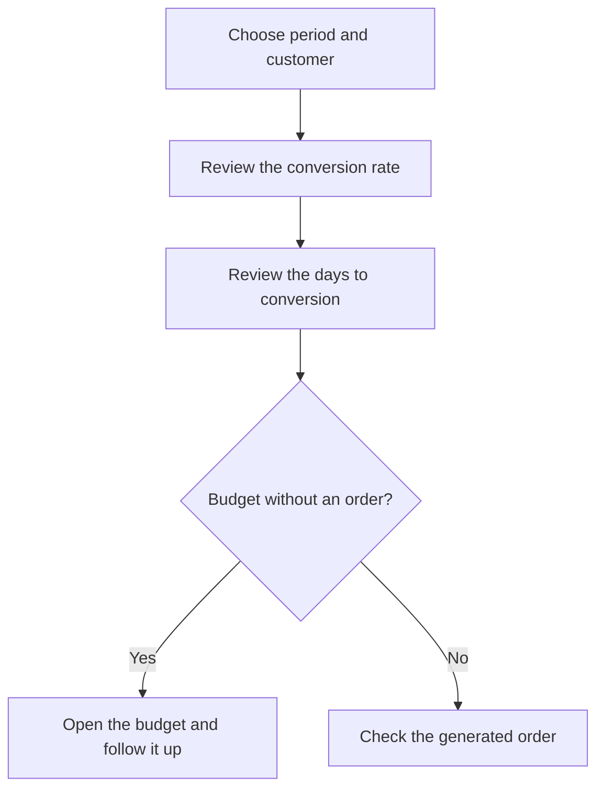

# Budget conversion

## What this screen is for

Measures how many budgets (quotations) from a period turned into a sales order, how long it took between the budget and the order, and what amount was converted. It sits at the start of the sales flow, `quotation -> sales order -> delivery note -> invoice`: use it to track sales effectiveness overall or for a specific customer.

## Available actions

- Choose the "Period" with the date picker. It filters by the budget date.
- Choose a "Customer" to limit the analysis to that customer's budgets.
- Apply the filter with "Filter". Changing the period or the customer also reloads the data.
- Go back to the current year and all customers with "Clear".
- Open the customer, the budget or the order by clicking the underlined name or code in the row.
- Sort the table by customer, budget code, status or order code.

## Usual flow

1. Open the screen: it shows the current year's budgets for all customers.
2. Review the cards, especially "Conversion rate" and "Avg. acceptance (days)".
3. Choose a "Customer" if you want to analyze only one.
4. In the table, look for budgets without an "Order code" to follow them up.
5. Click the "Budget code" to open the budget and act on it, or the "Order code" to see the generated order.

## Important notes

- The dashboard includes budgets that are not disabled, dated within the period and, if you chose one, belonging to that customer.
- **A budget counts as converted when it has a sales order created from it** with "Create sales order" and that order is not disabled. The budget's status plays no part: a budget with an order counts as converted whatever its status, and one marked as accepted but without an order does not count.
- If a budget has more than one order, only the earliest one by date is used.
- **"Budgets"**: number of budgets in the period. **"Orders"**: how many of them have an order.
- **"Conversion rate"**: "Orders" divided by "Budgets", as a percentage.
- **"Avg. acceptance (days)"**: average "Days to conversion" of the converted budgets. Budgets that were not converted are left out.
- **"Days to conversion"**: calendar days between the budget date and the order date.
- **"Budgeted amount"**: sum of the lines of every budget in the period, without taxes.
- **"Converted amount"**: sum of the current lines of the generated orders, without taxes. If the order lines were changed after the order was created, this amount already reflects those changes and can differ from the budgeted one.
- The table's "Amount" column is the budget's amount.
- The "Status" column shows the budget's status in its lifecycle.
- The screen is read-only: it does not change any budget or order.

## Common errors

- If an accepted budget does not show as converted, check that the order was created from the budget with "Create sales order". An order created by hand is not linked.
- If a budget is missing, check its date: the period filters by the budget date, not the order date.
- If "Converted amount" is higher or lower than "Budgeted amount", check whether the order lines were changed after the order was created.
- If the table is empty, check the chosen customer and that the period has an end date.

## Basic process

