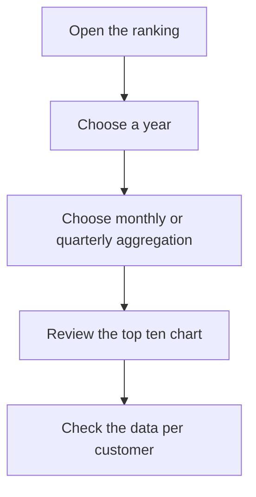

# Customer Ranking

## What this screen is for

Shows how much each customer was invoiced during a calendar year, sorted from highest to lowest, and how that revenue is spread across months or quarters. It is based on sales invoices: use it to identify your main customers and see at which time of year they concentrate their purchases.

## Available actions

- Choose the "Year" from the list: it offers the current year and the ten previous ones. Changing it reloads the data.
- Choose the "Aggregation": "Monthly" shows one column per month and "Quarterly" one per quarter.
- Clear the filter with the clear filters button: it goes back to the current year and the "Monthly" aggregation.
- See each customer's share on the "Chart" tab.
- Check the figures per customer and period on the "Data" tab. Every column can be sorted.

## Usual flow

1. Open the screen: it shows the current year grouped by month.
2. Review the "Total Invoices" and "Total Sales" cards.
3. On "Chart", see how much of the revenue the top ten customers account for.
4. Open "Data" to see each customer's revenue month by month.
5. Switch to "Quarterly" to compare quarters, or choose another "Year" to compare it with the previous year.

## Important notes

- The dashboard counts sales invoices that are not disabled and whose invoice date falls within the chosen year, from January 1 to December 31. The invoice date counts, not the due date or the delivery note date.
- Each invoice's amount is its total including taxes and transport. That is why "Total Sales" does not match "Revenue (YTD)" on the "Management dashboard", which counts the base amount without taxes.
- Corrective invoices subtract from the customer and count as one more invoice in "Total Invoices".
- **"Total Invoices"**: number of invoices in the year. **"Total Sales"**: sum of their amounts.
- **Chart**: pie with the ten customers with the highest revenue. The rest are grouped into a single slice, "Others". Hover over a slice to see its amount.
- **Data**: one row per customer, sorted by "Total" from highest to lowest. A dash means the customer has no revenue in that month or quarter.
- The customer name is the commercial name recorded on the invoice.
- The aggregation only changes how the data is presented: it does not query the server again.
- The screen is read-only: it does not change any invoice.

## Common errors

- If a customer is missing, check that it has invoices dated within the chosen year and that they are not disabled.
- If a customer's amount is lower than expected, check whether it has corrective invoices in that year.
- If the chart shows "No data to display", the chosen year has no sales invoices.
- If "Error loading customer ranking" appears, choose the year again. If it persists, tell your administrator.

## Basic process

