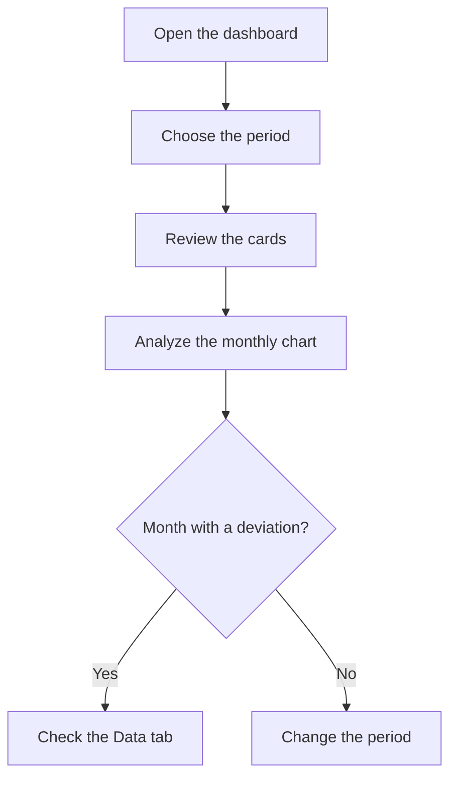

# Comparative cash flow dashboard

## What this screen is for

Compares, month by month, the expected collections from sales invoices with the expected payments for purchase invoices and expenses. It is not an invoicing view: each amount counts in the month of its due date or payment date, not in the month of the invoice. Use it to see in which months more money comes in or goes out, and how the balance develops within the chosen period.

## Available actions

- Choose the "Period" with the date picker. Once both a start and an end date are set, the dashboard recalculates on its own.
- Clear the filter with the clear filters button: it goes back to the current year, from January 1 to December 31.
- See the trend on the "Charts" tab.
- Check each movement on the "Data" tab, sortable by "Date".

## Usual flow

1. Open the screen: it shows the current year.
2. Review the four cards: "Incomes", "Expenses", "Net" and "Avg monthly net".
3. On "Charts", look for the months where the expenses line is above the incomes line and where the "Cumulative balance" drops.
4. Change the "Period" to focus on specific months or another year.
5. Open "Data" to see which due dates or expenses explain a given month.

## Important notes

- **"Incomes"**: sum of the due dates of sales invoices whose due date falls within the period. The amount is the invoice total including taxes, split according to the payment method. Corrective invoices subtract.
- **"Expenses"**: sum of two sources within the period:
  - the due dates of purchase invoices (total including taxes), by due date;
  - the expenses recorded in "Expense management", by payment date. Recurring expenses appear once for each generated payment.
- **"Net"** is "Incomes" minus "Expenses". It shows in green when positive and in red when negative.
- **"Avg monthly net"** is the sum of each month's net divided by the number of months that have any movement. Months with no due dates and no expenses are not counted.
- In the chart, "Incomes" and "Expenses" are each month's total. The "Cumulative balance" (grey area) adds up the net month by month from the first month with movements. It starts at zero: it is not the bank balance and does not include anything from before the period.
- On "Data", each row is a due date or an expense. The amount shows in green for an income and in red for a payment. The "Type", "Detail" and "Description" texts are generated automatically and are not translated:
  - sale: type "Venta", detail "Factura", description with the invoice number and the due date;
  - purchase: type "Compra", detail with the supplier's tax name, description with the supplier's invoice number and the invoice date;
  - expense: type "Despesa", detail with the expense type, and the expense's own description.
- All invoices are counted, whatever their status. A due date that has already been collected or paid still appears.
- The screen is read-only: it does not change any invoice or expense.

## Common errors

- If a sales invoice does not appear in the expected month, check its due dates: the due date counts, not the invoice date.
- If the dashboard does not change after you pick a date, check that you also picked the end date of the period.
- If a purchase invoice is missing, check that it has due dates. A purchase invoice without due dates adds no expense.
- If the message "Error loading dashboard data" appears, choose the period again. If it persists, tell your administrator.

## Basic process

