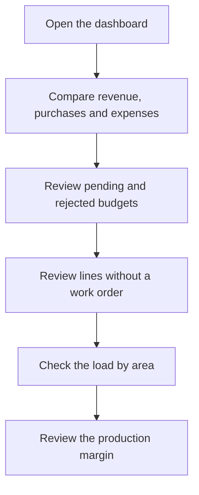

# Management dashboard

## What this screen is for

Summarizes the state of the business on a single screen: the fiscal year's revenue, purchases and expenses compared with the previous year, pending and rejected budgets, sales orders without a work order, customer trends, planned machine load and production margin. It is meant for a quick management review; to analyze an indicator in depth, use the specific dashboard (for example, "Budget conversion" or "Customer Ranking").

## Available actions

- Check the indicator cards. The screen has no filters: everything is calculated for the current fiscal year, the one that includes today's date.
- Hover over the "Planned machine hours by area" chart to see the hours for each area and week.
- Hide or show an area in the chart by clicking its name in the legend.
- Open the screen again to recalculate the data.

## Usual flow

1. Open the screen at the start of the week or month.
2. Compare "Revenue (YTD)", "Purchases" and "Expenses" with last year.
3. Review "Pending budgets" and "Rejected budgets" to follow up on sales.
4. Check "Order lines without work order" to spot orders that have not yet been released to production.
5. Look at the hours chart to see which areas are heavily loaded in the coming weeks.
6. Review "Production cost margin vs invoiced" to keep an eye on profitability.

## Important notes

- **Current fiscal year**: if no fiscal year in "Fiscal years" includes today's date, every card shows zero. Some cards call it "Current exercise".
- **"Revenue (YTD)"**: sum of the base amount, without taxes, of sales invoices that are not disabled, from the start of the fiscal year until today. "Same period last year" is the same date window one year earlier. The percentage is the change: green if it grows, red if it drops.
- **"Purchases"**: base amount without taxes of purchase invoices that are not disabled, by invoice date, with the same window and the same comparison.
- **"Expenses"**: amount of the expenses in "Expense management" whose payment date falls within the same window. For purchases and expenses, the percentage shows in green when it drops and in red when it rises.
- **"Pending budgets"**: all budgets that are not disabled and have the status "Pendent d'acceptar", whatever their date. "Pending amount" is the sum of their lines without taxes.
- **"Rejected budgets"**: budgets with the status "Rebutjat" dated within the current fiscal year.
- **"Order lines without work order"**: sales order lines that are not delivered and have no linked work order, from orders whose status is neither "Comanda Servida" nor "Comanda Facturada". It counts every line, including those for references that are not manufactured.
- **"New customers"**: active customers created in the last 30 days.
- **"Lost customers"**: customers with invoices in the whole previous fiscal year and none from the start of the current fiscal year until today.
- **"Planned machine hours by area"**: estimated hours of the open work orders, that is, not closed and not cancelled, spread by planned-date week over the six weeks starting with the current one:
  - the horizontal axis shows the week number (S followed by the number);
  - work orders whose planned date has already passed are added to the current week;
  - the estimated time of every non-external phase is counted, without subtracting work already done; cycle time is multiplied by the planned quantity;
  - each phase is assigned to the area of its "Preferred machine" or, if it has none, to that of a machine of its type;
  - only active areas marked "Visible in plant" appear. The number in brackets in the legend is the number of active machines in the area.
- **"Production cost margin vs invoiced"**: for the current fiscal year's closed work orders that have already been invoiced, the percentage is (invoiced − cost) / invoiced:
  - the cost is the machine, operator and material cost accumulated on each work order;
  - the invoiced amount is the amount without taxes of the invoice lines that come from the work order's sales order, through the delivery note;
  - the first line below shows how many work orders were analyzed and the total cost over the total invoiced.
- **"WIP"**: the same calculation for the fiscal year's work orders that are not yet closed or cancelled, comparing the cost accumulated so far with the amount of the linked sales order lines. A work order without a sales order line adds cost but no revenue, which lowers the margin.
- The screen is read-only: it does not change any data.

## Common errors

- If everything shows zero, check in "Fiscal years" that there is a fiscal year that includes today's date.
- If "Pending budgets" or "Rejected budgets" show zero when there should be some, check that the budget lifecycle statuses are named exactly "Pendent d'acceptar" and "Rebutjat".
- If an area is missing from the hours chart, turn on "Visible in plant" for it in "Areas".
- If a work order does not appear in any area's hours, check that its phases have a "Preferred machine" or a machine type with machines in visible areas.
- If a closed work order is not included in the margin, check that the sales order line has the work order linked and that it was delivered with a delivery note and invoiced.

## Basic process

