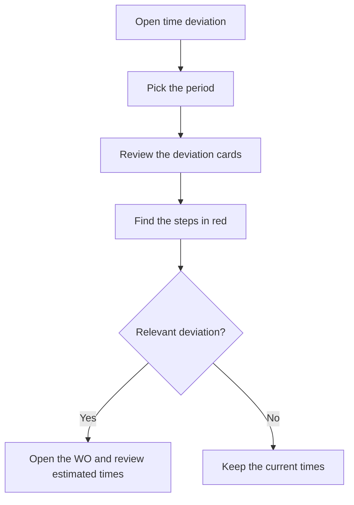

# Time deviation

## What this screen is for

Compares actual machine and operator time with the theoretical time of the manufacturing routes, step by step. The data comes from the production tickets of the period: for each step of a phase (for example, setup or production) it shows what was planned, how long it actually took and the difference. Use it to find the phases and work orders (WO) whose estimated times do not match reality.

## Available actions

- Pick the "Period". The data reloads by itself when you change it; the "Filter" button also reloads it.
- Press "Clear" to go back to the default period, the whole current year.
- Sort the table by "Work order", "Phase" or "Status".
- Open a WO by clicking its code in the "Work order" column.

## Usual flow

1. Open the screen: the current year is loaded.
2. Look at the cards at the top: "Machine deviation" and "Operator deviation" give the overall deviation as a percentage.
3. Narrow the "Period" down to the month or week you want to analyze.
4. Look in the table for rows with the deviation in red: those are the steps that took longer than planned.
5. Click the WO to review its phase and the estimated times of its steps.

## Important notes

- **Where the data comes from**: production tickets dated within the period. Tickets are generated automatically when a phase is finished on the plant machine screen, or created by hand in "Production tickets". Each row groups all the tickets of the period for the same step.
- **"Status"**: the machine status of the step (for example, setup or production).
- **"Quantity"**: the pieces declared on the step's tickets. On automatic tickets these are the good pieces.
- **"Theo. machine (min)"**: the step's estimated time. If the step uses cycle time, it is multiplied by the "Quantity"; otherwise it counts once.
- **"Real machine (min)"**: the machine time added up from the tickets.
- **"Theo. operator (min)"** and **"Real operator (min)"**: the same using the step's estimated operator time and the operator time on the tickets.
- **"Machine dev. (min)"** and **"Operator dev. (min)"**: actual minus theoretical. Red if positive (it took longer than planned) and green if zero or negative.
- **Cards**: "Theoretical machine", "Real machine", "Theoretical operator" and "Real operator" add up the minutes of all rows. "Machine deviation" and "Operator deviation" are the difference between actual and theoretical as a percentage of the theoretical.
- Time spent in machine statuses that are not a step of the phase does not generate tickets and does not appear here.
- The screen is read-only: it does not change any ticket or route.

## Common errors

- If the table is empty, there are no production tickets in the period: check that the phases were finished on the machine.
- If tickets from the last day of the period are missing, it is because the end day is not included: pick the following day as the end date.
- If a cycle-time step shows a "Quantity" of 0 and all its actual time as deviation, no good pieces were declared: the theoretical time stays at 0.
- If "Theo. operator (min)" is 0, the step has no estimated operator time on the WO.
- If a fixed-time step, such as a setup, has tickets in two periods, its full theoretical time appears in each period: widen the period to compare it properly.
- If the overall deviation is 0%, the total theoretical time may be 0: check that the steps have an estimated time.

## Basic process

