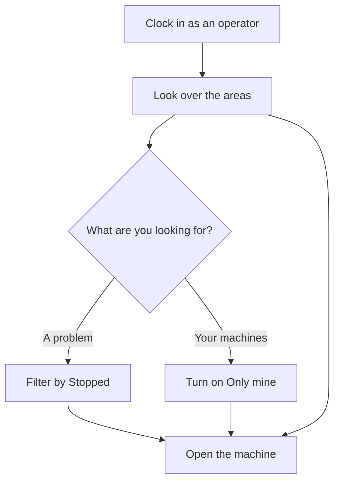

# Plant areas

## What this screen is for

Shows the status of every machine in the plant, grouped by area. At a glance you see which machines are running, which are stopped and which have no data, how long they have been in that status and which work order they have loaded. From here you open the machine you need to work on: `clock-in -> plant areas -> machine -> phase -> piece declaration`.

## Available actions

- Filter the machines by status: "All", "Running", "Stopped" or "No data". Each filter shows how many machines it has.
- Turn on "Only mine" to see only the machines you are clocked in to.
- Collapse or expand an area by tapping its header.
- Open a machine by tapping its tile (on a tablet) or its row (on a phone).
- Tap your name or initials at the top right, then "Exit" to free the tablet.

## Usual flow

1. Clock in with your code on "Operator clock-in".
2. Look over the areas: each header has a strip of squares in the status color of each machine.
3. If you are looking for a problem, tap "Stopped"; to go to your machines, turn on "Only mine".
4. Tap the machine you need to work on to open it.
5. When you finish, clock out of your machines and tap "Exit".

## Important notes

- Only areas marked "Visible in plant" in "Area management" are shown, and only active machines. An area with no machine matching the filter is hidden.
- Each machine's color is the color of its status, defined in "Machine status management". A gray hatched band means the machine has no data.
- The time is how long the machine has been in its current status: "38 min", "4 h 20 min" or "46 d 8 h". It updates by itself, without reloading the screen. A machine with no data shows "—".
- "Running" and "Stopped" depend on how each status is set up (stopped or closed). A machine with no status, or with a status that is not in the catalog, counts as "No data".
- Machines with no work order loaded show the name, the status, the time and, if any, the operators' initials. Machines with one also show the order and phase, the reference and the planned pieces.
- When you pick a status filter, every area with a machine in that status opens.
- Collapsed areas and "Only mine" are remembered on this device.
- The top bar shows the current shift and its hours (not on phones), the time and your name.
- "Exit" does not clock you out of machines: first tap "Clock out of the machine" on every machine you clocked in to.

## Common errors

- If a machine shows "No data", it has no status yet or its status is not in the catalog: open it and pick a status.
- If every machine shows "No data", the connection may be lost: reload the screen.
- If "Only mine" shows no machines, you are not clocked in to any: open the machine and tap "Clock in to the machine".
- If "No work centers in this status." appears, no machine matches the filter: go back to "All" or turn off "Only mine".
- If an area never appears, ask your supervisor to check "Visible in plant" in "Area management".

## Basic process

