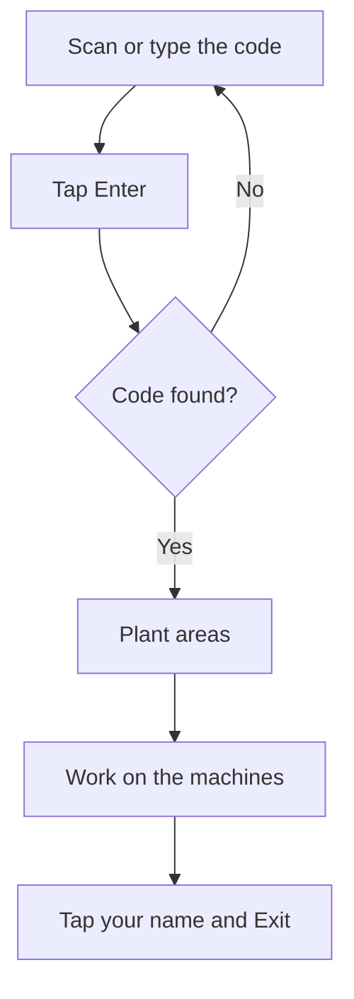

# Operator clock-in

## What this screen is for

This is the way into the plant. Here you identify yourself as an operator with your code before you start work. Then you go to the plant areas and pick the machine: `clock-in -> plant areas -> machine -> phase -> piece declaration`.

An operator is not an application user. The tablet is already signed in with a user; each operator only enters their own code.

## Available actions

- Scan your code with the scanner.
- Type the code on the on-screen numeric keypad.
- Tap "ABC" to type letters with the device keyboard, and "123" to go back to numbers.
- Delete the last character with the delete key, at the bottom right of the keypad.
- Tap "Enter" to go into the plant.

## Usual flow

1. Scan your code or type it into the "Operator code" field.
2. Tap "Enter".
3. The plant areas open, with your name at the top right.
4. Work on the machines you need.
5. When you finish, tap your name or initials at the top right, then "Exit". The tablet goes back to this screen.

## Important notes

- The code is shown as dots so nobody can read it.
- The code is the one the operator has in "Operator management". It must match exactly, including upper and lower case.
- "Enter" is disabled while the field is empty.
- The tablet remembers you: if it is closed or reloaded, you stay clocked in. The next operator cannot clock in until you tap "Exit".
- Clocking in here does not clock you in to any machine: it only says who is using the tablet. To work on a machine, open it and tap "Clock in to the machine".
- "Exit" does not clock you out of machines either. Before you exit, tap "Clock out of the machine" on every machine you clocked in to.
- On wide screens, the time, the date and the company name are shown next to the keypad.

## Common errors

- If "No operator has this code. Try again." appears, check the code (including upper case) and scan it again. The field clears itself.
- If the code is right and still not found, the operator may have been added recently: reload the screen. If it still fails, ask your supervisor to check the code in "Operator management".
- If the screen jumps straight to the areas, another operator is already clocked in on the tablet. Check the name at the top right; if it is not you, tap it and tap "Exit".
- If you cannot type letters, tap "ABC".

## Basic process

