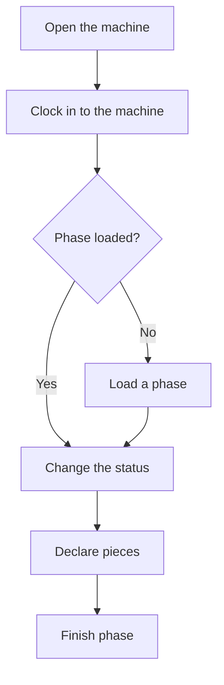

# Plant machine

## What this screen is for

This is the work screen next to the machine. It shows the machine status and how long it has been in it, the loaded work order and phase, the declared pieces and the operators working on it. From here you load a phase, change the machine status, declare pieces and finish the phase.

## Available actions

- Clock in to or out of the machine as an operator (button on the plate, at the top).
- Load a phase from the "Available phases" tab.
- Create a new phase from a template, inside the load dialog.
- Change the machine status with the status buttons on the bottom bar, or pick another one in "Other statuses".
- Declare good and bad pieces with "Declare pieces".
- Take the phase off the machine with "Finish phase": "Pause" leaves it unfinished and "Complete" marks it as done.
- Check the phase time, documents, comments and materials in the tabs.
- Edit the phase comment in "Comments" with "Edit".
- Move material to the machine's supply location from the "Materials" tab, with the button in the "Stock" column.

## Usual flow

1. Open the machine from the plant areas.
2. Tap "Clock in to the machine" on the plate to record your entry.
3. If no phase is loaded, open "Available phases", tap "Load" on the right order, pick the phase and the activity, and tap "Load the activity".
4. Change the machine status to match what you are doing (for example, setup and then production).
5. Declare pieces as you make them with "Declare pieces".
6. When you finish, tap "Finish phase", check the pieces and tap "Complete".

## Important notes

- The plate at the top always shows the current status in its color, the time in that status and since when. On phones too.
- The current status button is filled with its color and cannot be pressed again. The status buttons are the activities of the loaded phase and the closed machine status. If you tap the closed machine status while a phase is loaded, "Complete phase" opens first.
- "Declare pieces" and "Finish phase" only appear when a phase is loaded.
- You can only clock in to or out of the machine if the current status allows it; otherwise the button is disabled.
- In the load dialog, phases for another machine type are locked: they cannot be loaded on this machine.
- A new order cannot be loaded while a phase is in progress on the machine: finish it first.
- When declaring pieces, the button says exactly what will be declared, for example "Declare 8 good and 1 bad". Reasons for bad pieces are optional and can be split across several reasons.
- The "Current phase" tab compares the actual machine and operator time with the estimate, and warns when it goes over.
- On phones, the "Status" and "More" buttons open a sheet with the options.
- In the "Complete phase" dialog you enter the pieces and the rejection reasons. "Pause" takes the phase off the machine without finishing it, and you can load it again later. "Complete" marks it as done.
- Under "Options" you can choose to load the next phase of the same order for this machine type, and pick its activity. It only appears if such a phase exists, and not when the dialog opens from the closed machine status.
- When the phase comes off, the machine moves to the status marked as stopped. If the dialog opened from the closed machine status, it moves to that status. If you load the next phase, it moves to the activity you picked.
- If the phase has materials, "Complete" requires all of them to be provisioned at the machine and opens "Material consumption". By default all provisioned material is consumed; if some is left over, declare it with "Add piece" and tap "Confirm consumption". The phase is not completed until you confirm the consumption. "Pause" does not consume material.
- "Comments" shows the comments of the order, the phase and the activities. Only the phase comment can be edited.

## Common errors

- If "Clock in to the machine" is disabled, first change to a status that allows operators. Which statuses allow it is set up in "Machine status management".
- If you cannot load an order, check that no phase is in progress on the machine and that the phase is for this machine type.
- If a quantity warning appears when declaring pieces, check that the quantity does not exceed what came from the previous phase.
- If the split of reasons for bad pieces does not add up, the reasons must total the declared bad pieces.
- If "Materials not provisioned" appears, move the missing material to the supply location from the "Materials" tab and complete again.
- If "Activity is required" appears, pick the activity for the next phase or untick the option to load it.
- If "Unable to determine the phase exit status" appears, the phase lifecycle does not allow pausing or closing the phase from its current status: ask your supervisor to check it in "Lifecycle management".

## Basic process

