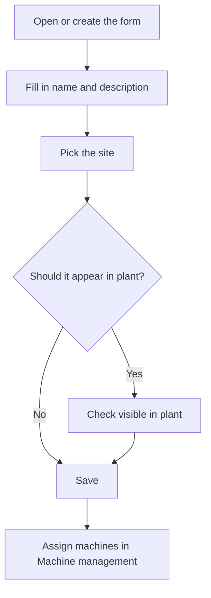

# Area

## What this screen is for

This is an area's form: its name, description, the site it belongs to and whether it appears in plant. The area is the third level of the plant structure (company -> site -> area -> machine) and it groups machines on the plant areas screen that operators use.

## Available actions

- Fill in the "Name" and "Description".
- Pick in "Site" the site the area belongs to.
- Check or uncheck "Visible in plant".
- Check or uncheck "Disabled".
- Save with "Save" in the header. After saving, the app goes back to the previous screen.

## Usual flow

1. From "Area management", tap "+" or click an area.
2. Fill in the name and description.
3. Pick the site in "Site".
4. Leave "Visible in plant" checked if operators should see the area in plant.
5. Save with "Save".
6. Assign machines to the area from each machine's form, in "Machine management".

## Important notes

- The "Name", "Description" and "Site" are required. The "Site" options are the sites from "Site management".
- The "Name" allows up to 50 characters, and you cannot create an area with the name of one that already exists.
- A new area starts with "Visible in plant" checked.
- If the area has "Visible in plant" and is not disabled, it appears on the plant areas screen with its active machines. That screen shows the visible areas of every site.
- Unchecking "Visible in plant" or checking "Disabled" hides the area and its machines on the plant screen, but the machines still exist and are managed in "Machine management".
- Machines are not added from here: each machine picks its area on its own form.
- To delete an area, do it from the list; read its help first, because deletion is permanent and can delete the area's machines.

## Common errors

- If "The name is required" or "The description is required" appears, fill in the highlighted field.
- If "The location is required" appears, pick a site in "Site"; if the list is empty, first create the site in "Site management".
- If creating the area says it already exists, there is already one with that name: choose another.
- If saving shows an error and the name is long, shorten it to 50 characters or fewer.
- If operators do not see the area in plant, check that "Visible in plant" is checked and "Disabled" is not.

## Basic process

