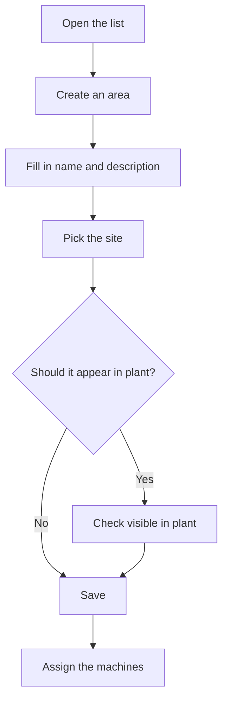

# Area management

## What this screen is for

This is where you manage areas, the third level of the plant structure: company -> site -> area -> machine. An area groups machines of a site, for example a workshop section. Every machine belongs to an area, and the plant areas screen that operators use shows the machines grouped by the areas that are visible in plant.

## Available actions

- Create an area with the "+" button ("Create new") in the list header.
- Open an area by clicking its row (on a phone, by tapping its card) to edit it.
- Delete an area with the trash icon ("Delete") on its row, after confirming.
- Check the "Name", "Description", "Visible in plant" and "Disabled" columns.

## Usual flow

1. Check in "Site management" that the site already exists.
2. Open "Area management" and tap "+".
3. Fill in the name and description and pick the site.
4. Decide whether the area should appear in plant, and save.
5. In "Machine management", assign machines to the area from each machine's form.

## Important notes

- The list has no filters: it shows every area, including disabled ones, sorted by name.
- The plant areas screen only shows areas with "Visible in plant" that are not disabled, together with their active machines.
- The form fields are explained in the help for the area form.
- Deleting an area is permanent and can also delete the machines that belong to it. If the area or its machines already have linked data, for example materials with this "Production area", the deletion can fail. If you no longer use the area, mark it as "Disabled" or remove it from plant instead of deleting it.

## Common errors

- If deleting an area shows an error, the area is already in use: disable it instead of deleting it.
- If an area does not appear on the plant screen, check that it has "Visible in plant" and is not "Disabled".
- If a machine shows up in the wrong area, fix it in the machine's form, in "Machine management".

## Basic process

