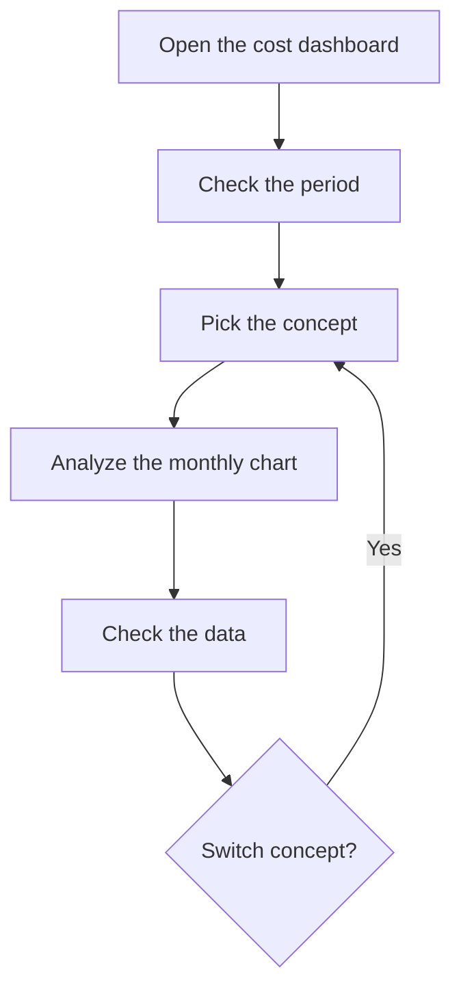

# Production cost dashboard

## What this screen is for

Shows each month's production cost split by operator, by work center type or by work center. The data comes from production tickets, which record the time worked on each phase and the hourly cost of the operator and the machine. Use it to see where labor and machine cost builds up and how it changes month by month.

## Available actions

- Pick the "Period" in the filter. By default it runs from the first day of the month six months ago until today.
- Pick the "Concept": "Operaris", "Tipus de centre de treball" or "Centre de treball" (the options are shown in Catalan: operators, work center type, work center). The data reloads by itself when you change the period or the concept; there is no filter button.
- Clear the filter with the clear filters button: it empties the period and the concept.
- See the bar chart on the "Charts" tab.
- Check the month-by-month figures on the "Data" tab.

## Usual flow

1. Open the dashboard: the period is already set, but nothing is shown until you pick a concept.
2. Pick the "Concept", for example "Tipus de centre de treball".
3. On "Charts", compare the height of each month's bars and hover over them to see each item's amount and the month's total.
4. Open "Data" to see the exact hours and cost for each month.
5. Switch to "Operaris" to see the same period from the labor point of view.

## Important notes

- **Where the data comes from**: production tickets dated within the period. Tickets are generated automatically when a phase is finished on the plant machine screen, or created by hand in "Production tickets". Each ticket counts in the month of its date.
- **Operators**: adds up the operator time on the tickets and its cost (time multiplied by the operator hourly cost stored on the ticket), grouped by operator and month.
- **Work center type** and **Work center**: add up the machine time and its cost (time multiplied by the machine hourly cost stored on the ticket), grouped by type or work center and month. They do not include operator cost.
- Cost uses the hourly cost each ticket had when it was created. Changing an operator's or machine's costs later does not recalculate older tickets.
- Only tickets with an operator assigned are counted. Time a machine worked with no operator clocked in does not appear on this dashboard, not even under "Centre de treball".
- **Charts**: stacked bars, one column per month and one color per operator, type or work center. Hovering shows each item's amount and the month's "Total".
- **Data**: one row per item and month with "Year", "Month" (as a number), "Monthly time" in hours and "Monthly cost" in euros. Depending on the concept, only the matching "Operator", "Type of center" or "Work center" column is filled in.
- The screen is read-only: it does not change any ticket.

## Common errors

- If the chart shows "Select a date range and a concept to view the data", pick a concept and check that the period has both a start and an end date.
- If tickets from the last day of the period are missing, it is because the end day is not included: pick the following day as the end date.
- If a month is empty or lower than expected, check that the phases were finished on the machine: until then there are no tickets.
- If a machine is missing or shows fewer hours than it worked, check whether operators were clocked in: tickets without an operator are not counted.
- If hours appear but the cost is 0, the ticket was created without an hourly cost. Check the configured costs of the operator or the machine for new tickets.

## Basic process

