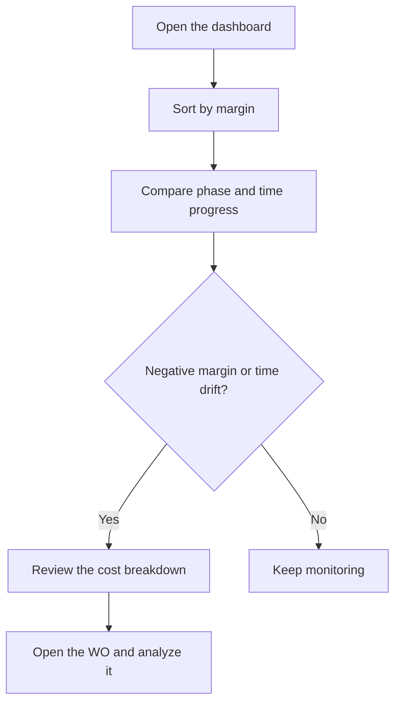

# Production dashboard

## What this screen is for

Tracks the work orders (WO) that are in production right now: how far they have progressed in phases and in time, how much they have cost so far, and what margin is left against the price. Use it to spot early the WOs that drift from the planned time or have already used up more cost than will be charged.

## Available actions

- Search by WO code, reference code or reference description in the "Search" field. The list filters as you type.
- Sort by any column by clicking its header.
- Hover over the "Time progress" percentage to see the actual and theoretical time in minutes.
- Hover over the "Accumulated cost" to see its breakdown: material, machine, operator and external services.
- Open a WO by clicking its row.

## Usual flow

1. Open the dashboard: it lists every WO in the "Producció" (production) status, sorted by code.
2. Sort by "Margin" to see the WOs with a negative margin (in red) first.
3. Compare "Phase progress" with "Time progress": if time advances much faster than phases, the WO is running slower than planned.
4. Hover over the "Accumulated cost" to see which item weighs most.
5. Click the WO to review its phases, tickets and material.

## Important notes

- **Which WOs appear**: only those in the "Producció" status. There is no date filter: the dashboard always shows the current situation.
- **"Quantity"**: the WO's planned quantity.
- **"Phase progress"**: the percentage of the WO's phases in the "Tancada" (closed) status out of all its phases.
- **"Time progress"**: the actual machine time on the WO's production tickets divided by the theoretical time of all its phases. Theoretical time adds up the estimated times of the steps; cycle-time steps are multiplied by the planned quantity. Above 100% the bar turns red.
- **"Order price"**: the unit price on the reference record multiplied by the planned quantity. It is not the price on the sales order line.
- **"Theoretical cost"**: the theoretical manufacturing cost on the reference record multiplied by the planned quantity. It is for information only and does not affect the margin.
- **"Accumulated cost"**: the sum of operator, machine, material and external services:
  - Operator and machine: the time on each of the WO's production tickets multiplied by the hourly cost stored on that same ticket.
  - Material: warehouse consumption movements linked to the WO's phases, valued at the last cost of the consumed reference. Returns are subtracted.
  - External services: the service and transport cost of external phases already in the "Tancada" status.
- **"Margin"**: "Order price" minus "Accumulated cost". Red if negative, orange if zero and green if positive. The margin shrinks as the WO progresses, because the price is the full amount while the cost only covers the work done so far.
- Production tickets are generated automatically when a phase is finished on the plant machine screen, or created by hand in "Production tickets". The time of a phase still in progress does not count until the phase is finished.
- The screen is read-only: it does not change anything.

## Common errors

- If "No manufacturing orders in production." appears, no WO is in the "Producció" status. WOs in other statuses (for example, released or paused) do not appear.
- If a WO shows 0% "Time progress", it has no production tickets yet: no phase has been finished on the machine.
- If "Order price" or "Theoretical cost" is 0, check the unit price and the theoretical manufacturing cost on the reference record.
- If the material part of "Accumulated cost" is 0, there are no warehouse consumptions linked to the WO's phases.
- If external services are missing, check that the external phase is in the "Tancada" status.
- If "Error loading the production dashboard" appears, open the screen again. If it persists, contact your administrator.

## Basic process

