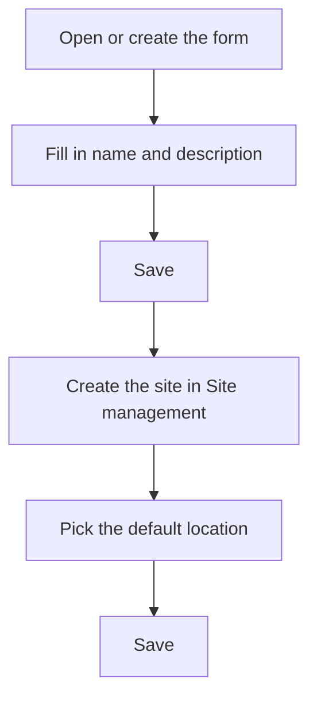

# Company

## What this screen is for

This is a company's form: its name, description, default site and whether it is active. The company is the first level of the plant structure (company -> site -> area -> machine). The "Name" is printed as the company name in the header of printed documents, and the "Default location" is the site assigned to new sales orders, delivery notes and sales invoices.

## Available actions

- Fill in the "Name" and "Description".
- Pick the site in "Default location".
- Check or uncheck "Disabled".
- Save with "Save" in the header. After saving, the app goes back to the previous screen.
- Leave without saving with the back button in the header.

## Usual flow

1. From "Company management", tap "+" to create a new company or click a row to open an existing one.
2. Fill in the "Name" (short, up to 10 characters) and the "Description".
3. Save with "Save".
4. In "Site management", create the company's site and pick this company in the "Company" field.
5. Open the company again, pick the site in "Default location" and save.

## Important notes

- "Name" and "Description" are required. The name allows at most 10 characters, even though the field lets you type more.
- You cannot create a company with the name of one that already exists.
- "Default location" only lists the sites that belong to this company. For a new company the list is empty until you create a site for it.
- If "Default location" is left empty, sales orders, delivery notes and sales invoices cannot be created.
- Only one company can be active. If you uncheck "Disabled" while another company is active, saving fails.
- If you disable the only active company, sales orders, delivery notes and sales invoices cannot be created either.
- The logo, color and brand name are set up on the "Branding" screen. Saving this form does not change them.
- If the site chosen as "Default location" is deleted, the field becomes empty and you must pick another one.
- To delete a company, do it from the list; read its help first, because deletion is permanent.

## Common errors

- If "The name is required" or "The description is required" appears, fill in the highlighted field.
- If saving shows an error and the name is long, shorten it to 10 characters or fewer.
- If creating the company says it already exists, there is already one with that name: choose another.
- If saving a company without "Disabled" shows an error, check in "Company management" that no other company is active.
- If "Default location" shows no options, first create a site for this company in "Site management".

## Basic process

