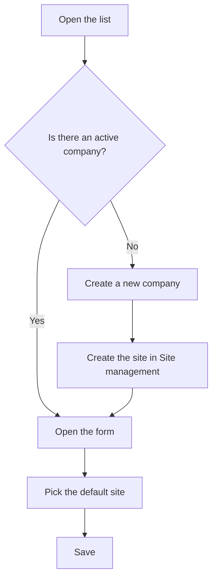

# Company management

## What this screen is for

This is where you register the company that works with the ERP. It is the first level of the plant structure: company -> site -> area -> machine. The active company and its default site are what the app uses when creating sales orders, delivery notes and sales invoices, and the company name appears in the header of printed documents. There is usually only one.

## Available actions

- Create a company with the "+" button ("Create new") in the list header.
- Open a company by clicking its row (on a phone, by tapping its card) to edit it.
- Delete a company with the trash icon ("Delete") on its row, after confirming.
- Check the "Name", "Description", "Default site" and "Disabled" columns.

## Usual flow

1. Open "Company management" and check whether there is already an active company, that is, one without "Disabled".
2. If there is none, tap "+", fill in the name and description, and save.
3. Go to "Site management" and create the company's site with its address and tax details.
4. Come back here, open the company and pick that site in "Default location".
5. Set up the company logo and colors on the "Branding" screen.

## Important notes

- Only one company can be active at a time. To activate another one, first mark the current one as "Disabled".
- If there is no active company, or the active company has no default site, sales orders, delivery notes and sales invoices cannot be created.
- The list has no filters: it shows every company, including disabled ones, sorted by name.
- Each field is explained in the help for the company form.
- Deleting a company is permanent and also removes its "Branding" logos. A company that has sites cannot be deleted. If you no longer use the company, mark it as "Disabled" instead of deleting it.

## Common errors

- If "The enterprise ... could not be deleted" appears, the company has sites: disable it instead of deleting it.
- If creating a sales order, delivery note or sales invoice says the site does not exist, check here that there is exactly one active company and that it has a "Default site".
- If the "Default site" column is empty, open the company and pick the site in "Default location".

## Basic process

