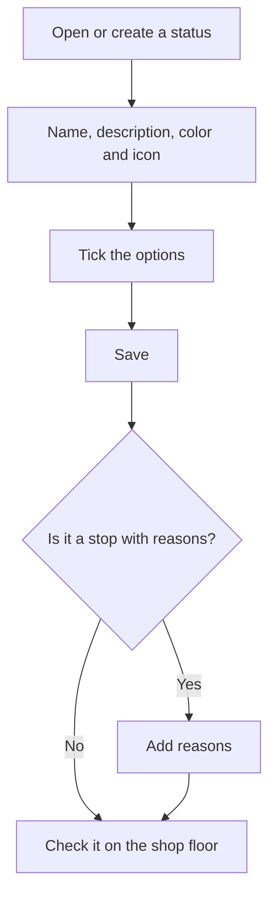

# Machine status

## What this screen is for

This is the form for one machine status. Here you decide how the status looks on the shop floor (name, color and icon), how it behaves (whether it is a stop, whether operators can clock in, whether it closes the machine) and which reasons the operator can choose when putting the machine in that status.

## Available actions

- Fill in the "Name", "Description", "Color" and "Icon" ("Select an icon").
- Tick the "Stopped", "Operators", "Closed", "Preferred", "Allow OF" and "Disabled" options.
- Save with "Save" in the header. After saving, you return to the list.
- In the "Reasons" table, add a reason with "Add reason", edit it with the pencil icon or delete it with the trash icon. The table only appears once the status has been saved.

## Usual flow

1. From "Machine statuses", tap "+" or open a status.
2. Fill in the name, description and color, and pick an icon.
3. Tick the options according to how it should behave on the shop floor.
4. Tap "Save".
5. If it is a stop, open the status again and add its reasons with "Add reason".
6. Open a machine on the shop floor and check that the status looks as expected.

## Important notes

- The "Name", "Description" and "Color" are required. The color paints the status buttons and the machine plate on the shop floor; the icon appears on the "Other statuses" cards.
- "Stopped": the status counts as a stop. If it has reasons, when the operator chooses it in "Other statuses" they must also pick a reason, which then shows on the machine plate as "Reason: ...". When a phase is finished without loading another one, the machine moves to a status marked as "Stopped".
- "Operators": the operator can only clock in to or out of the machine while it is in a status with this option. A new status has it ticked.
- "Closed": this is the status of the button that stops the machine in the shop-floor status bar. If a phase is loaded, that button first opens the phase finishing dialog.
- "Preferred": the status is listed first in "Other statuses".
- "Disabled": the status no longer appears on the shop floor or in the machine status dropdown of phase templates.
- Reasons are saved when you accept their dialog, without tapping the status "Save". Each reason needs a "Code" that is unique within the status (maximum 20 characters), a "Name" (maximum 100) and a "Color"; the "Description" and "Icon" are optional.
- Deleting a reason is immediate and permanent: it does not ask for confirmation.
- Changes show on the shop floor the next time the machine screen is opened.

## Common errors

- If you cannot save, check the "The name is required", "The description is required" and "The color is required" messages.
- If creating shows "Entity already exists", there is already a status with that name.
- If saving a status with a long name fails, shorten it: the name must be 50 characters or fewer.
- If "A reason with this code already exists for this machine status" appears, choose another code for the reason.
- If the shop floor does not ask for a reason when choosing the status, check that it is marked as "Stopped" and has reasons.
- If the operator cannot clock in to the machine, the current status does not have the "Operators" option ticked.

## Basic process

