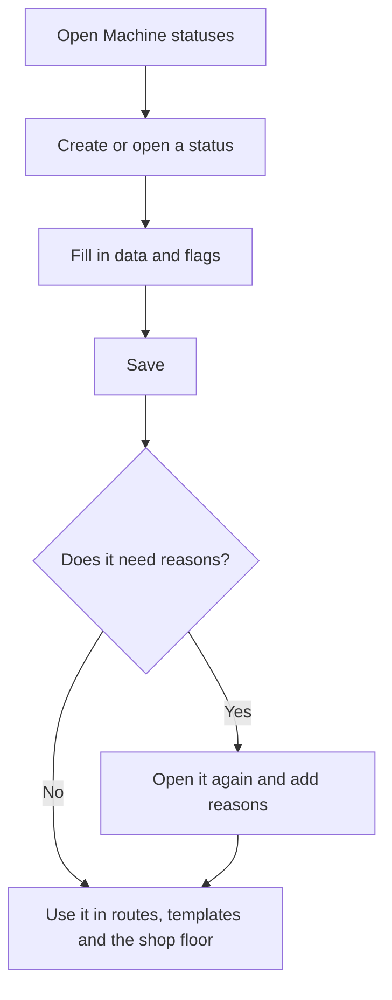

# Machine status management

## What this screen is for

This screen defines the statuses a machine can be in on the shop floor, such as setup, production, pause or stop. Every step of a manufacturing route, every activity of a manufacturing order phase and every detail of a phase template points to a machine status. On the shop floor, these statuses are the buttons the operator uses to change the machine status. They are also used in "Machine costs".

## Available actions

- Create a new status with the "+" button ("Create new") in the table header.
- Open a status by clicking its row to change its data and reasons.
- Delete a status with the trash icon on its row, after confirming.
- Review at a glance the "Color", "Icon" and the "Stopped", "Operators", "Closed", "Preferred", "Allows manufacturing orders" and "Disabled" flags of each status.

## Usual flow

1. Open "Machine statuses". The list is sorted by name.
2. Tap "+" to create a status, or click a row to change it.
3. Fill in the name, description and color, and tick the options you need.
4. Tap "Save". You return to the list.
5. If the status needs reasons, for example a stop, open it again and add them under "Reasons".

## Important notes

- The list shows every status, including disabled ones. It has no filters.
- Disabled statuses do not appear on the shop floor or in the machine status dropdown of phase templates.
- On the shop floor, statuses are read again every time a machine screen is opened.
- The status marked as "Closed" is the button that stops the machine in the shop-floor status bar. Mark only one.
- When a phase is finished on the shop floor without loading another one, the machine moves to the status marked as "Stopped".
- In the shop-floor areas, machines in a "Stopped" or "Closed" status count as "Stopped".
- Deletion is permanent and also removes the status's reasons and machine costs. A status used by the shift history, manufacturing route or work order steps or phase template details cannot be deleted; in that case, mark it as "Disabled".
- The meaning of each flag is explained in the "Machine status" help.

## Common errors

- If creating a status shows "Entity already exists", there is already a status with that name.
- If "The machine status ... could not be deleted" appears, the status is in use: mark it as "Disabled" and it will no longer appear on the shop floor.
- If the shop floor has no button to stop the machine, or shows "Closed machine status was not found", mark an active status as "Closed".

## Basic process

