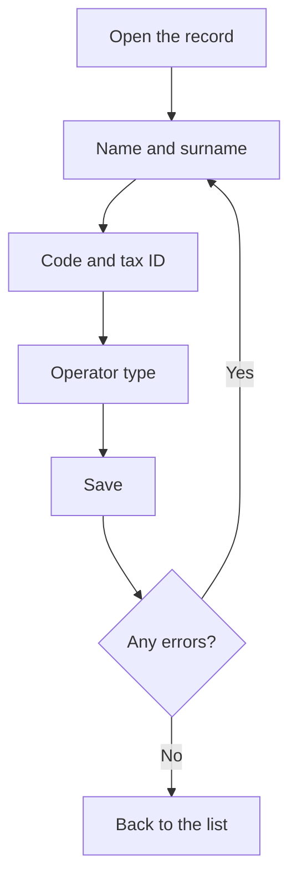

# Operator

## What this screen is for

This is an operator's record. Here you create a new operator ("Create operator") or edit an existing one ("Operator: name"). The details that matter most are the code, which the operator types to clock in on the shop floor, and the operator type, which sets the hourly cost charged while they work on a machine.

## Available actions

- Fill in or edit "Name", "Surname", "Code", and "Tax ID".
- Choose the "Type of operator".
- Check or uncheck "Disabled".
- Save with "Save", in the screen header.
- Go back to the list with the back button, without saving.

## Usual flow

1. From "Operator management", click "New" or open an operator.
2. Enter the name and surname.
3. Give them a short code that no other operator has.
4. Enter the tax ID.
5. Choose the operator type.
6. Click "Save". "Operator created successfully" or "Operator updated successfully" appears and you return to the list.

## Important notes

- All text fields and the operator type are required. The code allows at most 10 characters, the tax ID 20, and the name and surname 250.
- The code is what the operator types in "Operator code" on the "Operator clock-in" screen. It must match exactly, including upper and lower case.
- The system checks that the code is not repeated when you create an operator, but not when you edit one. Do not change an operator's code to one another operator already uses.
- The operator type gives the operator's hourly cost. When the operator clocks in on a machine, the hourly cost of their type at that moment is stored. Changing their type later does not change costs already recorded; it only affects new clock-ins.
- The "Type of operator" selector also shows disabled types: choose an active one.
- If the operator already has recorded activity, they cannot be deleted: check "Disabled" to deactivate them and keep their history.

## Common errors

- If "Save" does not save, check the messages under the fields: a required field is missing or a maximum length is exceeded, for example "The code cannot exceed 10 characters".
- If "Operator ... already exists" appears, the code is already assigned to another operator: change it.
- If the "Type of operator" selector is empty, first create the types in "Operator type management".

## Basic process

