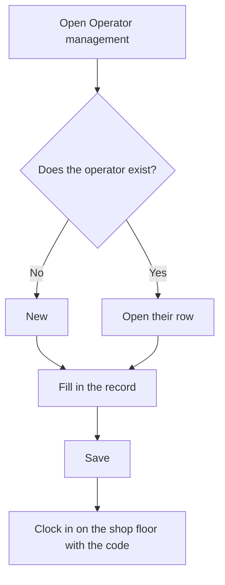

# Operator management

## What this screen is for

Lists every operator with their code, full name, tax ID, operator type, and whether they are disabled. From here you create new operators, open an operator's record to edit it, and delete operators created by mistake. The operator's code is what they type to clock in on the shop floor, on the "Operator clock-in" screen, and their operator type sets the hourly cost charged while they work on a machine.

## Available actions

- Create an operator with the "New" button: the "Create operator" record opens.
- Open an operator's record by clicking its row, to edit their details.
- Delete an operator with the trash icon on its row, after confirming.
- Check the assigned operator type in the "Type" column and whether the operator is disabled in the "Disabled" column.

## Usual flow

1. Check in "Operator type management" that the type the operator will have already exists.
2. Click "New".
3. Fill in the name, surname, code, tax ID, and operator type.
4. Save with "Save": you return to the list and the operator now appears in it.
5. Give the code to the operator so they can clock in on the shop floor.

## Important notes

- The list is sorted by the operator's name and has no filters.
- The code identifies the operator when they clock in on the shop floor: they must type it exactly the same, including upper and lower case.
- When you create an operator, the system does not allow a code that already exists.
- Deletion is permanent. You can only delete an operator who has no recorded activity yet, such as machine clock-ins or declared parts. If they do, open their record and check "Disabled" to keep their history.
- The record's fields and rules are explained in the help for the "Operator" screen.

## Common errors

- If saving a new operator shows "Operator ... already exists", another operator already uses that code: choose a different one.
- If deleting shows "Conflict with the current state of the resource", the operator already has recorded activity and cannot be deleted: disable them instead.
- If an operator cannot get into the shop floor, check in the "Code" column that the code is exactly what they type.

## Basic process

