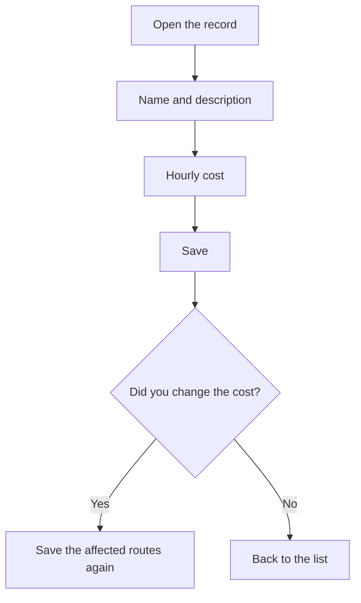

# Operator type

## What this screen is for

This is an operator type's record. Here you create a new type ("Create operator type") or edit an existing one ("Operator type: name"). The key value is "Cost/hour", which the system applies to the working time of operators of this type to calculate the labor cost of routes and manufacturing orders.

## Available actions

- Fill in or edit "Name" and "Description".
- Enter the "Cost/hour" in euros.
- Check or uncheck "Disabled".
- Save with "Save", in the screen header.
- Go back to the list with the back button, without saving.

## Usual flow

1. From "Operator type management", click "New" or open a type.
2. Enter a short name and a description.
3. Enter the hourly cost.
4. Click "Save". "Operator type created successfully" or "Operator type updated successfully" appears and you return to the list.
5. If you changed the cost, save again the manufacturing routes that use it so their estimated cost is recalculated.

## Important notes

- "Name", "Description", and "Cost/hour" are required. Name and description allow at most 250 characters, and the cost cannot be negative.
- The name must be unique: the system checks it when you create the type.
- Estimated cost: each phase of a manufacturing route has an operator type. The route's operator cost is the phase's operator time multiplied by the type's hourly cost, and it is recalculated every time the route is saved.
- Actual cost: when an operator clocks in on a machine, the hourly cost of their type at that moment is stored. That value is used to calculate the "Operator cost" in "History" and the operator cost of manufacturing orders.
- Changing the hourly cost does not change clock-ins already made: it only affects new clock-ins and routes when they are saved again.
- A disabled type no longer appears in the "Type of operator" selector on route and manufacturing order phases.

## Common errors

- If "Operator type ... already exists" appears, a type with that name already exists: change it.
- If "The cost is required" or "Cost cannot be negative" appears, enter a cost of zero or more.
- If a route's operator cost comes out as zero, check that its phases have an operator type selected and that this type has an hourly cost.

## Basic process

