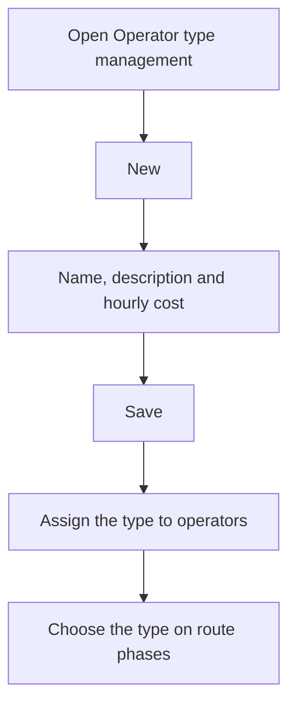

# Operator type management

## What this screen is for

Lists the operator types. Each type has an hourly cost that the system uses to calculate labor cost: the estimated cost of manufacturing routes, based on the operator type of each phase, and the actual cost when operators clock in on machines. Each operator has a type assigned in "Operator management".

## Available actions

- Create an operator type with the "New" button: the "Create operator type" record opens.
- Open a type's record by clicking its row, to change its name, description, or hourly cost.
- Delete a type with the trash icon on its row, after confirming.
- Check in the "Disabled" column which types are disabled.

## Usual flow

1. Click "New".
2. Fill in the name, description, and hourly cost.
3. Save with "Save".
4. Assign the type to operators in "Operator management".
5. Choose it on the phases of manufacturing routes so the estimated cost includes labor.

## Important notes

- The list is sorted by description and has no filters.
- Deleting an operator type also deletes the operators assigned to it. Review them first in "Operator management".
- You cannot delete a type used on route or manufacturing order phases, or one where any of its operators already has recorded activity. In those cases, mark it as "Disabled".
- A disabled type no longer appears in the "Type of operator" selector on route and manufacturing order phases.
- The record's fields and how the hourly cost is applied are explained in the help for the "Operator type" screen.

## Common errors

- If saving a new type shows "Operator type ... already exists", a type with that name already exists.
- If deleting shows "Conflict with the current state of the resource", the type is used on some phase or one of its operators already has activity: disable it instead of deleting it.

## Basic process

