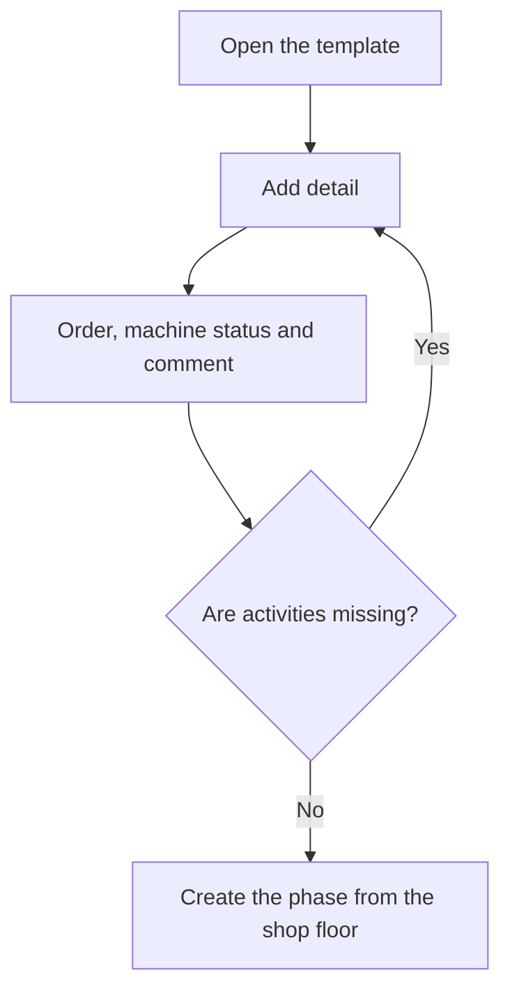

# Phase template

## What this screen is for

This is the form for one phase template. The name and description are at the top; below is the "Template details" table with the activities. Each detail is a machine status with an order and a comment. When a phase is created from this template on the shop floor, each detail becomes an activity of the phase, that is, a machine status button.

## Available actions

- Change the "Name", "Description" and "Disabled", and save them with "Save" in the header.
- Add a detail with the "+" button ("Add detail") of "Template details". The "Create detail" dialog opens with "Order", "Machine status" and "Comment".
- Edit a detail by clicking its row ("Edit detail" dialog).
- Delete a detail with the cross on its row, after confirming.

## Usual flow

1. From "Phase templates", create a template or open one.
2. Tap "+" in "Template details".
3. Review the suggested order, choose the "Machine status" and, if needed, write a comment for the operator.
4. Tap "Save" in the dialog and repeat for each activity.
5. Check in the table that the activities are in the right order.
6. If you changed the name, description or "Disabled", tap "Save" in the header.

## Important notes

- Details are saved when you accept their dialog. The header "Save" only saves the name, description and "Disabled", and keeps you on the same screen.
- The order of a new detail is suggested in multiples of 10 based on the existing details (10, 20, 30...). It must be positive. The table and the shop-floor activity buttons follow this order.
- The "Machine status" dropdown only lists active statuses, and shows them by their description; the table shows the status name.
- "Disabled" hides the template from the shop-floor dialog.
- To create the phase on the shop floor, choose the template, enter the "Phase code" (digits only) and the "Phase description", check the "Work center" and tap "Create phase".
- The new phase copies the activities with their order and comment, but without estimated times. Later changes to the template do not affect phases already created.
- A template without details creates a phase without activities.

## Common errors

- If the dialog does not save, check "Order is required", "Order must be positive" and "Machine status is required".
- If saving the header shows "Name is required", fill in the "Name".
- If a detail shows in the table without a machine status, its status has been disabled: edit the detail and choose an active status.
- If you cannot find a status in the dropdown, check in "Machine statuses" that it is not disabled.
- If the shop floor shows "The phase code must be numeric", enter the code using digits only.

## Basic process

