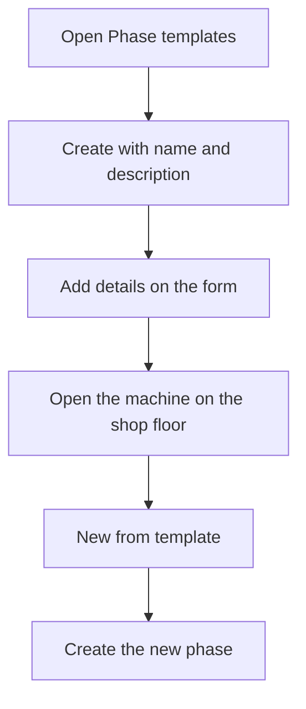

# Phase templates

## What this screen is for

A phase template is an ordered list of activities, each with a machine status and a comment. It is used to create a new phase of a manufacturing order directly on the shop floor, from the "Load a phase" dialog, "New from template" tab, without defining the activities by hand. This screen lists the templates and lets you create, open and delete them.

## Available actions

- Create a template with the "+" button ("Create new"): the "Create phase template" dialog opens with the "Name" and "Description".
- Open a template by clicking its row to edit it and add details.
- Delete a template with the trash icon on its row, after confirming.

## Usual flow

1. Open "Phase templates". The list is sorted by name.
2. Tap "+", enter the name and, if needed, the description.
3. Tap "Save". The form of the new template opens straight away.
4. On the form, add the details: the order, machine status and comment of each activity.
5. On the shop floor, open the machine, open the load dialog, go to "New from template", choose the template and create the phase.

## Important notes

- The list shows every template, including disabled ones. It has no filters.
- Only templates that are not disabled appear on the shop floor.
- A new template has no details: add them on the form before using it, or the phase created from it will have no activities.
- Deletion is permanent and also removes the template details.
- Phases already created from a template do not change if the template is later edited or deleted: its activities are copied when the phase is created.

## Common errors

- If creating shows "Name is required", fill in the "Name" before saving.
- If a template does not appear on the shop floor, check that it is not marked as "Disabled".
- If the shop floor shows "No active phase templates were found", there are no templates or all of them are disabled.

## Basic process

