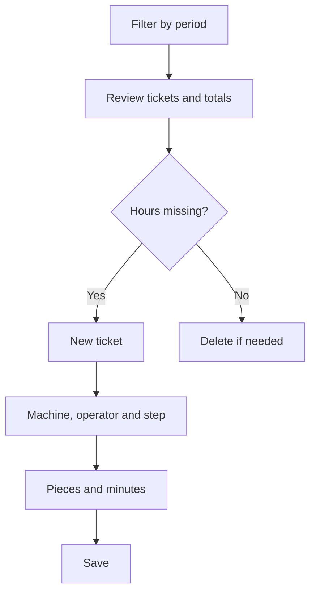

# Production tickets

## What this screen is for

This screen gathers all production tickets. Each ticket records, for a machine, an operator, and a step of a manufacturing order phase, the pieces made and the machine and operator minutes. Use it to review and correct the hours booked, and their cost, over a period. Tickets feed the hours, quantities, and costs of each manufacturing order.

## Available actions

- Filter with "Filters" by "Period", "Machine", "Operator", and "OF" (manufacturing order), then apply with "Filter".
- Empty the filters with "Clear".
- Create a manual ticket with "New", which opens "Create production ticket".
- Delete a ticket with the cross on its row, after confirming.
- Check the totals of "Quantity", "Machine time", "Operator time", "Operator cost", and "Machine cost" at the bottom of the table.

## Usual flow

1. Check the "Period": by default it is the fiscal year for the current year.
2. Filter by "Machine", "Operator", or "OF" if needed and press "Filter".
3. Review the tickets and the totals at the bottom of the table.
4. To book hours that were not declared at the plant, press "New".
5. Choose the "Machine", the "Operator", and the "Ticket date"; then, in "Manufacturing Order | Phase | Activity", choose the order, phase, and step.
6. Enter the "Quantity", the "Work center time (minutes)", and the "Operator time (minutes)", then save.

## Important notes

- The "Period" is required and filters by ticket date. The order list in the filter includes the orders whose expected date falls within the same period.
- Filters are saved per user when you leave the screen.
- The "OF" column shows the order code, the phase, and the step's machine status.
- In the creation dialog, the "Manufacturing Order | Phase | Activity" list depends on the chosen machine: only phases of its machine type are listed. If you change the machine, the selection is cleared.
- When you save, the system sets the hourly costs: the operator's comes from their operator type, and the machine's from "Machine costs" for the step's machine status.
- Operator cost = operator time × hourly cost / 60; machine cost = machine time × hourly cost / 60. The "Machine cost" total also shows the sum of both costs.
- Each ticket adds its pieces ("Total quantity"), times, and operator and machine costs to the manufacturing order. Deleting it subtracts them.
- Tickets do not change the good and bad pieces of the phases and do not create stock movements.
- When a phase is finished on the plant machine, tickets are created automatically from the recorded time. If the phase is finished again, those automatic tickets are recalculated; manual tickets are kept.
- Deleting a ticket is permanent.

## Common errors

- If "Invalid filter" appears, select a complete period.
- If you cannot save, check "Select a machine", "Select an operator", and "Select a manufacturing order".
- If the order, phase, and activity list is empty, make sure you chose the machine and that there are orders with phases of that machine type.
- If "You must enter an integer quantity (can be 0)" or "You must enter the time and it must be greater than 0" appears, enter pieces and minutes without decimals.
- If the machine cost is 0, check in "Machine costs" that the machine has a cost for the step's machine status.
- If a ticket is missing, check that its date is within the filtered "Period".

## Basic process

