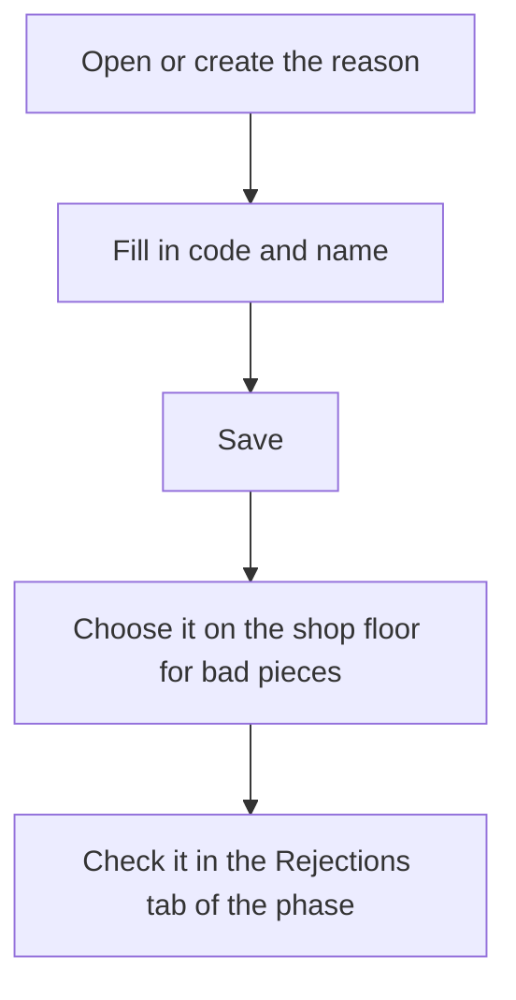

# Rejection reason

## What this screen is for

This is the form for one rejection reason: the code and name the operator uses to say why a piece came out bad. On the shop floor, the reason is chosen in the "Rejection reasons" section of "Declare pieces" and "Finish phase". Recorded rejections can then be checked on the manufacturing order phase, in the "Rejections" tab.

## Available actions

- Fill in the "Code", "Name", "Description" and "Color".
- Tick or clear "Disabled" to remove the reason from the shop floor without losing its history.
- Save with "Save" in the header. After saving, you return to the list.

## Usual flow

1. From "Rejection reasons", tap "+" or open an existing reason.
2. Enter a short, unique code, for example an abbreviation.
3. Enter the name the operator should see on the shop floor.
4. If needed, add a description explaining when to use it.
5. Tap "Save".

## Important notes

- The "Code" is required, has a maximum of 20 characters and cannot be repeated, not even with a disabled reason.
- The "Name" is required, has a maximum of 100 characters and is the text shown in the shop-floor dropdown.
- The "Description" and "Color" are optional.
- A "Disabled" reason no longer appears on the shop floor, but rejections already recorded with it are kept.
- On the shop floor, each reason can be used only once in the same declaration, and the units split among the reasons must add up exactly to the bad pieces declared. Declaring without assigning any reason is also allowed.
- On the shop floor, the list of reasons is loaded only once: after creating or disabling a reason, the shop-floor page must be reloaded.

## Common errors

- If "A rejection reason with code ... already exists" appears, choose another code; also check the disabled reasons in the list.
- If "The code is required" or "The code cannot exceed 20 characters" appears, check the "Code" field.
- If "The name is required" or "The name cannot exceed 100 characters" appears, check the "Name" field.
- If the shop floor shows "Rejection reason ... is disabled", the shop-floor page had an old list: reload it and choose an active reason.

## Basic process

