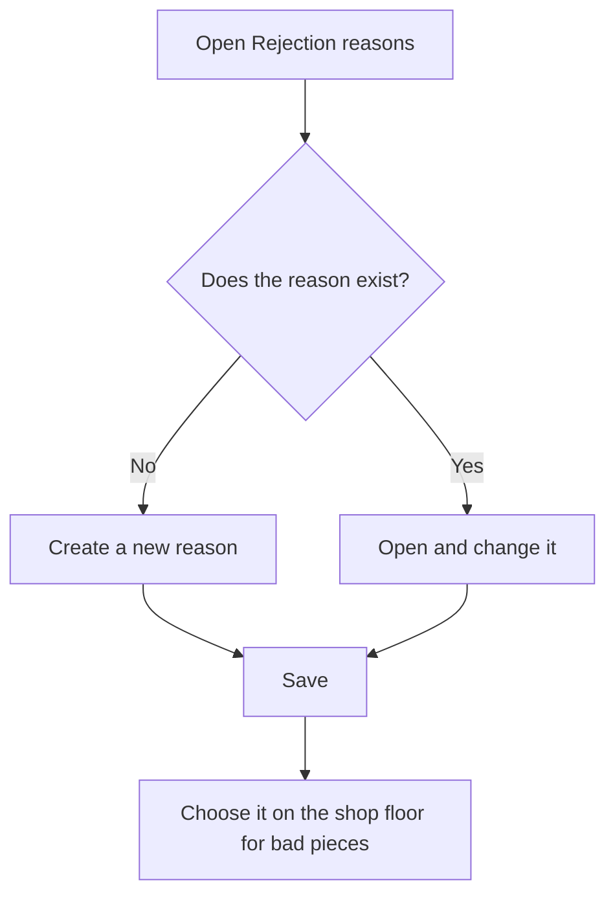

# Rejection reasons

## What this screen is for

This screen keeps the catalog of rejection reasons: the causes why a piece comes out bad. On the shop floor, when the operator declares bad pieces with "Declare pieces" or when finishing the phase, they split those pieces among the reasons in this catalog. This way, each phase of the manufacturing order records how many pieces were rejected and why.

## Available actions

- Create a new reason with the "+" button ("Create new") in the table header.
- Open a reason by clicking its row to change it.
- Delete a reason with the trash icon on its row, after confirming.
- Check in the list the "Code", "Name", "Description" and whether the reason is "Disabled".

## Usual flow

1. Open "Rejection reasons". The list is sorted by code.
2. Check that the reason you need does not already exist.
3. Tap "+" to create a new one, or click a row to change it.
4. Fill in the code and name on the form and tap "Save". You return to the list.
5. When a reason is no longer used, open it and tick "Disabled" instead of deleting it.

## Important notes

- The list shows every reason, including disabled ones. It has no filters.
- On the shop floor, only reasons that are not disabled can be chosen.
- Deletion is permanent. A reason that already has rejected pieces recorded cannot be deleted: disable it instead.
- Disabling a reason does not change rejections already recorded; it only stops it from being chosen in new declarations.
- On the shop floor, the list of reasons is loaded only once. After creating or disabling a reason, reload the shop-floor page so the operator sees the change.
- The form fields and their rules are explained in the "Rejection reason" help.

## Common errors

- If deleting shows "Rejection reason ... cannot be deleted because it has rejected units linked to it", the reason has already been used on the shop floor: mark it as "Disabled".
- If a reason does not appear on the shop floor when declaring bad pieces, check that it is not "Disabled" and reload the shop-floor page.

## Basic process

