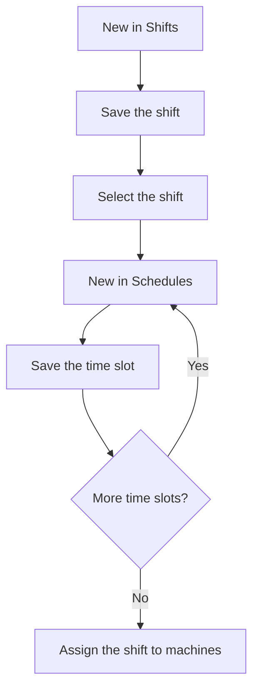

# Shift management

## What this screen is for

Defines work shifts and the time slots of each shift. On the left is the "Shifts" table and on the right the "Schedules" table, with the time slots of the selected shift. Each machine has a shift assigned in the "Shift" field of "Machine management", and the shop floor shows the current shift and its time slot in the header.

## Available actions

- Create a shift with the "New" button of the "Shifts" table: the "Create shifts" dialog opens with "Name" and "Disabled".
- Select a shift by clicking its row to see its time slots in the "Schedules" table.
- Add a time slot to the selected shift with the "New" button of the "Schedules" table: the "Configuració de torns" dialog opens with "Start time", "End time", and "Productive time".
- Save each dialog with "Save" or close it with "Cancel".

## Usual flow

1. Click "New" in the "Shifts" table, enter the shift name, and click "Save".
2. Click the new shift's row to select it.
3. Click "New" in the "Schedules" table.
4. Choose the start and end times, check or uncheck "Productive time", and click "Save".
5. Repeat the previous step for each time slot of the shift.
6. Assign the shift to machines in "Machine management", in the "Shift" field.

## Important notes

- The "New" button of the "Schedules" table only appears when a shift is selected.
- This screen can only create shifts and time slots: it cannot edit or delete them. Check the data carefully before saving.
- A new time slot defaults to 00:00 to 23:59 with "Productive time" checked: adjust it before saving. Times are saved in hours and minutes.
- The system does not check that a shift's time slots do not overlap or that the end time is later than the start time.
- Time slots are sorted by start time.
- Two shifts cannot have the same name.
- Every machine must have a shift: on the machine's record, the "Shift" field is required.

## Common errors

- If creating a shift shows "Entity already exists", a shift with that name already exists: change it.
- If you do not see the "New" button in the "Schedules" table, first select a shift in the "Shifts" table.
- If the time slot you just created does not appear in the "Schedules" table, click the shift again to refresh its time slots.
- If a time slot was saved with a wrong time, it cannot be corrected from this screen: keep this in mind before saving.

## Basic process

