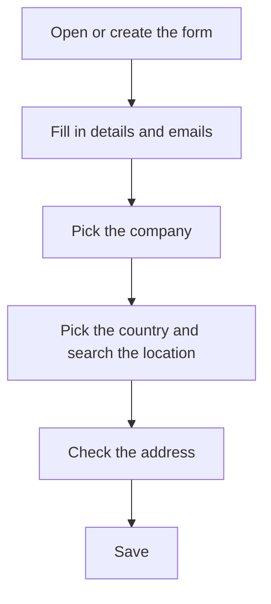

# Site

## What this screen is for

This is a site's form: which company it belongs to, its tax and contact details and its address. The site is the second level of the plant structure (company -> site -> area -> machine). When it is the default site of the active company, its details are the ones used by sales orders, delivery notes and sales invoices, and they appear in the header of printed documents.

## Available actions

- Fill in the "Name", "Description", "Company tax ID" and "Phone".
- Fill in the "General email", "Purchase email" and "Sales email".
- Pick the "Company" the site belongs to.
- Check or uncheck "Disabled".
- Pick the "Country" and search for the address in "Search location" to fill it in automatically.
- Type or correct the "Address", "City", "Region" and "Postal code" by hand.
- Expand "Coordinates" to see or edit the "Latitude" and "Longitude", and open the location with "View on map".
- Save with "Save" in the header. After saving, the app goes back to the previous screen.

## Usual flow

1. From "Site management", tap "+" or click a site.
2. Fill in the name, description, tax ID and phone.
3. Fill in the three emails and pick the "Company".
4. Pick the "Country", type the address in "Search location" and choose the right result.
5. Check the address, city, region and postal code that were filled in.
6. Save with "Save".

## Important notes

- The "Name", "Description", "Company" and the three emails are required, and the emails must have a valid email format.
- To create sales orders, delivery notes and sales invoices, the default site of the active company must have "Address", "City", "Region", "Postal code", "Country" and "Company tax ID". The form can be saved without them, but the sales document is then rejected.
- The "Name" allows up to 50 characters, the "Company tax ID" up to 12 and the "Phone" up to 25. You cannot create a site with the name of one that already exists.
- "Search location" is only enabled once a "Country" is set. Choosing a result fills in the address, city, region, postal code and coordinates; clearing the search empties those fields.
- On save, if there is an address, city and country, the app tries to work out the coordinates from the address and replaces any existing ones.
- "View on map" only appears when the site has coordinates.
- The site's coordinates are the starting point used to calculate the "Distance from site (km)" of customer addresses and suppliers.
- The header of printed documents shows the company name and, from the site, the address, the postal code with the city and region, the phone, the email and the tax ID. The email shown is the "Sales email", or the "General email" if the former is empty.
- Site details are read at print time. If you change them, documents that already exist also change when printed again.
- To delete a site, do it from the list; read its help first, because deletion is permanent.

## Common errors

- If "The email is not valid" or a similar warning appears on one of the emails, check the format of the three email fields.
- If "The company is required" appears and the company list is empty, first create the company in "Company management".
- If creating the site says it already exists, there is already a site with that name: choose another.
- If saving shows an error, first check the length of the "Name", "Company tax ID" and "Phone".
- If "Search location" is disabled, pick the "Country" first.
- If a sales document is rejected because the site is not valid, complete the address, city, region, postal code, country and tax ID here.

## Basic process

