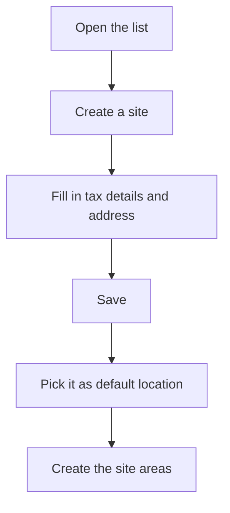

# Site management

## What this screen is for

This is where you manage the company's sites, the second level of the plant structure: company -> site -> area -> machine. A site is a physical location with its own tax and contact details. Those details appear in the header of printed documents, and areas and warehouses always belong to a site.

## Available actions

- Create a site with the "+" button ("Create new") in the list header.
- Open a site by clicking its row (on a phone, by tapping its card) to edit it.
- Delete a site with the trash icon ("Delete") on its row, after confirming.
- Check the "Name", "Description", "City", "Address" and "Disabled" columns.

## Usual flow

1. Check in "Company management" that the company already exists.
2. Open "Site management" and tap "+".
3. Fill in the name, description, company, tax ID, emails and address, and save.
4. In "Company management", open the company and pick this site in "Default location".
5. Create the site's areas in "Area management" and assign warehouses to it in "Warehouse management".

## Important notes

- The list has no filters: it shows every site, including disabled ones, sorted by name.
- The required fields and the data that sales documents need are explained in the help for the site form.
- The default site of the active company is the one assigned to new sales orders, delivery notes and sales invoices.
- Deleting a site is permanent and can carry along the data that depends on it, such as its areas and machines, warehouses or delivery notes. If the site has already been used in documents, the deletion can fail. If you no longer use the site, mark it as "Disabled" instead of deleting it.
- If you delete a company's default site, the company is left without a default site and no sales documents can be created until you pick another one.

## Common errors

- If deleting a site shows an error, the site is already in use: disable it instead of deleting it.
- If creating a sales order, delivery note or sales invoice says the site is not valid, open the company's default site and complete the address, city, region, postal code, country and tax ID.
- If a site is not offered as a company's "Default location", open it and check that the "Company" field holds that company.

## Basic process

