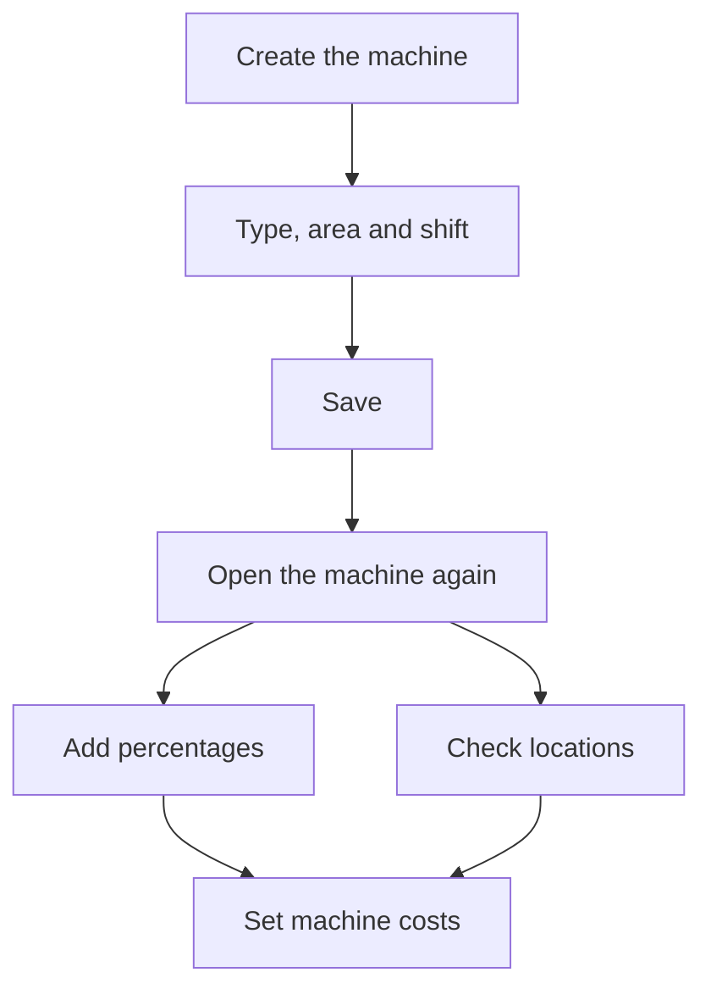

# Machine

## What this screen is for

This is the record of a machine. It sets how the machine is identified, which type, area and shift it belongs to, and which profit margin applies to it. The tabs let you add an image, a list of profit percentages and the warehouse locations where material is left for work on it. The title shows "Create machine" when you create it and "Machine: " followed by the name when you edit it.

## Available actions

- Fill in the "Name", "Description", "Type", "Area" and "Shift", all required, and the "Profit margin" if needed.
- Check "Disabled" to take the machine out of the plant without deleting it.
- Save with "Save", in the header. Saving takes you back to the list.
- "Image" tab: upload a file with the upload button, and view, download or delete it. Only one file is allowed.
- "Percentages" tab: add a profit percentage with "+" ("New profit percentage" dialog) and delete it with the "X" on its row.
- "Locations" tab: link a warehouse location with "+" ("Link location" dialog) and unlink it with the "X" on its row.

## Usual flow

1. From "Machine management", press "+".
2. Fill in the name, description, type, area and shift, and press "Save".
3. Open the machine again from the list.
4. In "Percentages", add the profit margins that can apply to this machine.
5. In "Locations", check the supply location and link others if needed.
6. Set the hourly rate of each machine status in "Machine costs".

## Important notes

- When the machine is created, the system automatically creates a supply location named "APR-" followed by the machine name in an active warehouse, and links it in the "Locations" tab. If there is no active warehouse, none is created.
- Add percentages and locations after saving the new machine: the tabs are visible from the start, but they need the machine to exist.
- Linked locations are used on the plant machine screen: a material counts as supplied when it has stock in any of these locations, and material moved to the machine goes to the linked location. Unlinking a location does not delete it from the warehouse.
- Checking "Disabled" removes the machine from the plant and from the "Preferred machine" list in phases, and also disables its supply location. Clearing it enables them again.
- The plant only shows active machines in areas that have "Visible in plant" checked.
- Profit margin on a manufacturing route phase: when you choose this machine as "Preferred machine", if the "Percentages" tab has values, the phase margin is picked from that list. Otherwise the machine's "Profit margin" is proposed if it is greater than 0, and the machine type's margin if not.
- On a work order phase, the machine's "Profit margin" is proposed if it is greater than 0, and the type's margin if not. Changing margins here does not change phases already saved.
- Percentages must be greater than 0, at most 100, and cannot be repeated.
- The machine's hourly rate is not set here but in "Machine costs", with one rate per machine status.

## Common errors

- If "The type is required", "The area is required" or "The shift is required" appears, choose a value in each dropdown. If a dropdown is empty, open the machine from "Machine management" so the options load.
- If "Workcenter ... already exists" appears, there is already a machine with that name.
- If saving a long name fails, shorten it: a machine name can have at most 50 characters.
- If "The percentage ...% already exists" or "This location is already assigned to this machine." appears, the value is already in the list.
- If "Supply location not found for the workcenter" appears when moving material to the machine in the plant, link an active location in the "Locations" tab.

## Basic process

