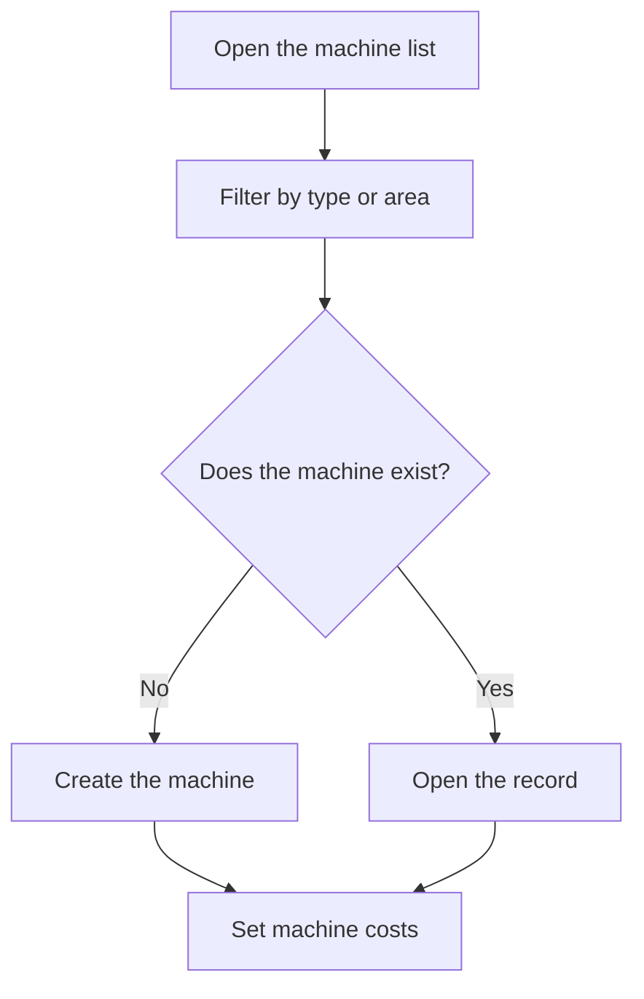

# Machine management

## What this screen is for

Lists every machine in the plant with its type and area. From here you find a machine to open its record or create a new one. Machines are the basis of plant work and cost calculation: machine type -> machine -> machine costs -> manufacturing route and work order phases -> plant work.

## Available actions

- Filter the list by "Type" and by "Area".
- Reset the filters with the "Clear filters" icon.
- Create a machine with the "+" button ("Create new").
- Open a machine by clicking its row.
- Delete a machine with the trash icon ("Delete"), after confirming.
- Check the "Name", "Description", "Type", "Area" and "Disabled" columns.

## Usual flow

1. Choose a type or an area in the filters to narrow the list.
2. Click the machine to open its record, or press "+" to create one.
3. Fill in the machine data and save it.
4. Set the hourly rate of each machine status in "Machine costs".
5. When a machine stops working, open it and mark it as "Disabled" instead of deleting it.

## Important notes

- Filters apply instantly and are remembered: when you come back to the screen, you will find the last filters you used.
- The filters only offer active types and areas. In the table, the "Type" or "Area" column is empty when the machine has a disabled type or area.
- The list includes disabled machines. A disabled machine does not appear in the plant and cannot be chosen as "Preferred machine" in phases.
- The plant only shows active machines in areas that have "Visible in plant" checked in "Area management".
- Deleting is permanent and also removes the data that depends on the machine, such as its per-status costs, its profit percentages and the supply location created for it (if it has no stock or movements). A machine that has already worked (production parts or shift history) or is the "Preferred machine" of a phase cannot be deleted: disable it.
- The fields and tabs of the record are explained in the help of the "Machine" screen.

## Common errors

- If "The machine ... could not be deleted" appears, the machine has already worked or is the "Preferred machine" of a manufacturing route or work order phase: disable it.
- If you cannot find a machine, check the "Type" and "Area" filters and reset them with "Clear filters".
- If a machine does not appear in the plant, check that it is not disabled and that its area has "Visible in plant" checked.

## Basic process

