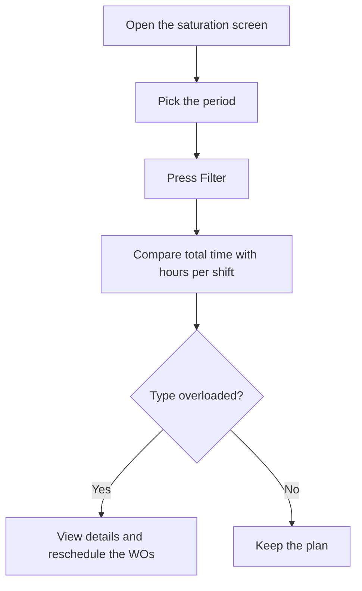

# Work center saturation

## What this screen is for

Shows how much work is planned for each work center type in a period: it adds up the estimated time of the phases of the work orders (WO) planned for those dates. Use it to spot which machine types are overloaded before releasing production, and to compare the load with the hours available on one, two or three shifts.

## Available actions

- Pick the "Period" in the filter and press the "Filter" button (funnel icon) to calculate the load.
- Clear the filter with the clear filters button: it empties the period and the result.
- Sort the table by "Work center type" or "Total estimated time".
- Open the detail of a type with "View details": it lists the phases that make up that load.
- In the detail, sort by "Work order", "Priority", "Planned date", "Phase code", "Quantity" or "Estimated time".

## Usual flow

1. Open the screen: the period is set to the fiscal year of the current year and the table loads.
2. Change the "Period" to the weeks or month you want to plan and press "Filter".
3. Read the summary of working days and hours per shift shown next to the filter buttons.
4. Look at the types with the highest "Total estimated time" (the table is already sorted from highest to lowest).
5. Press "View details" to see which WOs and phases add load, sorted by priority and planned date.
6. If a type is overloaded, reschedule the WOs or change their priority from the work order screens.

## Important notes

- **Which WOs are counted**: only WOs that are not disabled, whose planned date falls within the period, and whose status carries the "Available" tag in "Lifecycles". WOs in other statuses (for example, closed ones or statuses without that tag) do not load any machine.
- **Which phases are counted**: every phase of those WOs that has a work center type assigned. Phases without a type do not appear anywhere.
- **"Estimated time" of a phase**: the sum of the estimated times of its steps. If a step uses cycle time, its time is multiplied by the WO's planned quantity; otherwise it counts once.
- **"Total estimated time"**: the sum of the estimated time of all phases of the type, shown in hours and minutes.
- The load is the full estimated time of each phase: work already produced is not subtracted and the phase status is not checked.
- The number of work centers of that type is shown in brackets next to the type name. To compare with capacity, multiply the hours per shift by the number of work centers.
- The capacity summary counts every Monday to Friday in the period as a working day and 8 hours per shift. It ignores holidays, calendars and each machine's actual shifts.
- The screen is read-only: it does not change any WO or phase.

## Common errors

- If "Invalid filter" appears with "Select a valid period", pick both the start and the end date before pressing "Filter".
- If the table is empty and has no period when you open the screen, there is no fiscal year named after the current year (for example, "2026"): pick the period by hand.
- If the table is empty with a period selected, check that there are WOs planned for those dates and that their status carries the "Available" tag in "Lifecycles".
- If a WO you expected is missing, check its planned date, its status and that its phases have a work center type.
- If a phase shows 0 time, its steps have no estimated time or the phase has no steps.
- If a phase's time looks too high, check whether a step is marked as cycle time: it is then multiplied by the whole planned quantity.

## Basic process

