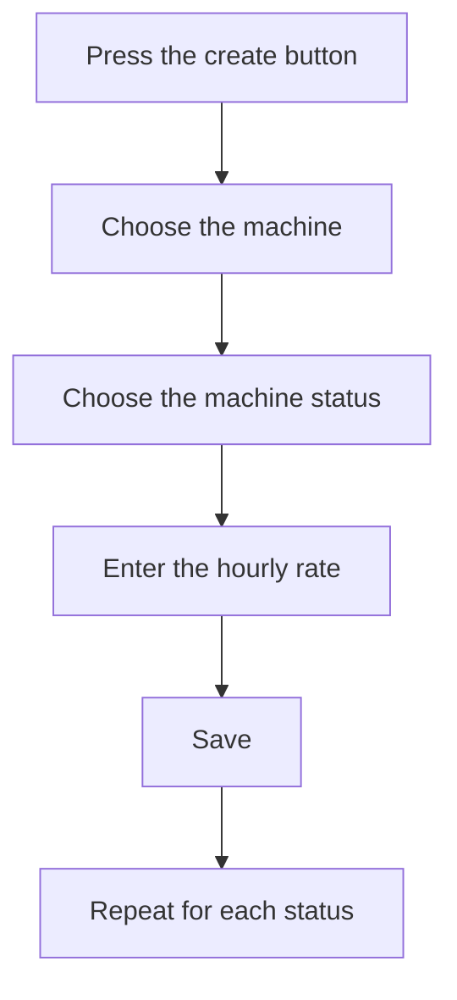

# Machine cost

## What this screen is for

This is the record of an hourly rate: which machine, in which machine status, and how much each hour of work in that status costs. The title shows "Create machine cost" when you create it and "Edit machine cost" when you edit it. How these rates are used in manufacturing routes and in the plant is explained in the "Machine costs" help.

## Available actions

- Choose the "Machine", which is required.
- Choose the "Machine status", which is required.
- Enter the "Hourly rate" in euros, which is required.
- Check or clear "Disabled".
- Save with "Save", in the header. Saving takes you back to the list.

## Usual flow

1. From "Machine costs", press "+".
2. Choose the machine.
3. Choose the machine status.
4. Enter the hourly rate.
5. Press "Save".
6. Repeat for each status the machine works in.

## Important notes

- The rate is per hour: plant and manufacturing route times are counted in minutes and converted to hours to apply it.
- Each machine can have only one rate per machine status. A combination that already exists cannot be created or saved.
- The "Machine status" dropdown shows every status defined in "Machine status management", including disabled ones.
- The rate can be 0; those combinations can be found in the list with the "Cost 0" filter.
- Changing the rate does not recalculate costs already recorded in the plant: it only affects later status changes and route cost calculations made from now on.
- Checking "Disabled" does not stop the rate from being used in calculations.

## Common errors

- If "The machine is required", "The machine status is required" or "The cost is required" appears, fill in that field before saving.
- If "Entity already exists" appears, this machine already has a rate for that status: find it in the list with the "Machine" filter and edit it.
- If the "Machine" dropdown is empty, open the record from "Machine costs" so the machines load.

## Basic process

