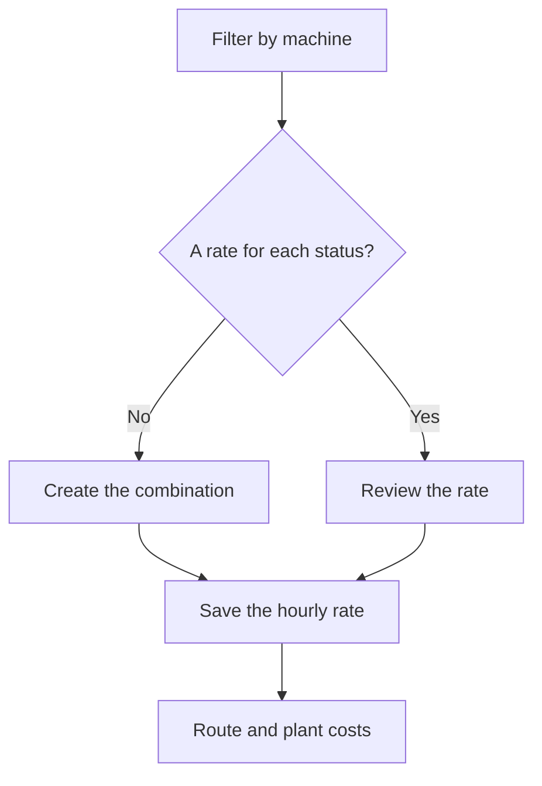

# Machine costs

## What this screen is for

Lists the hourly rate of each machine in each machine status. These rates feed the estimated machine cost of manufacturing routes and the actual cost recorded when the machine works in the plant: machine and machine status -> hourly rate -> manufacturing route cost and production tickets -> "Production cost dashboard".

## Available actions

- Filter the list by "Machine".
- Check the "Cost 0" filter to see only combinations with a zero rate.
- Reset the filters with the "Clear filters" icon.
- Create a new combination with the "+" button ("Create new").
- Open a row to change its rate.
- Delete a combination with the trash icon ("Delete"), after confirming.
- Check the "Machine", "Machine status", "Cost" and "Disabled" columns.

## Usual flow

1. Choose the machine in the "Machine" filter.
2. Check that there is one row for each machine status it works in.
3. Check "Cost 0" to find rates still to be filled in.
4. Press "+" to add a missing combination, or open a row to change its rate.
5. Save and return to the list.

## Important notes

- Each machine and machine status combination can have only one rate. The list is sorted by machine and the filters are remembered when you come back.
- Manufacturing routes: the estimated machine cost is the time of each step, converted to hours, multiplied by the rate of the phase's "Preferred machine" in the step's machine status.
- On a manufacturing route phase, a step cannot be added or changed if any machine of the phase's type, disabled ones included, has no rate for the step's machine status.
- Plant: every time the machine changes status, the hourly rate in force at that moment is stored. If there is no rate for that combination, 0 is stored.
- When a phase is finished, production tickets take the time-weighted average rate. These tickets feed the work order machine cost and the "Production cost dashboard".
- Changing a rate does not recalculate costs already recorded: it only affects later status changes and route cost calculations made from now on.
- The "Disabled" flag does not stop the rate from being used in calculations. To stop applying it, change its value.
- Deleting is permanent. Afterwards, status changes for that combination are recorded at cost 0, and route cost calculations that need it cannot be completed.

## Common errors

- If "Workcenter cost not found" appears when adding a step to a route phase, a machine of the phase's type has no rate for that machine status: filter by each machine of the type and add the combination.
- If a route cost calculation fails with "Workcenter and machine status combination not found", check that each phase has a "Preferred machine" and that this machine has a rate for every status used in its steps.
- If machine costs in the plant come out as 0, use the "Machine" filter to check that the combination exists and "Cost 0" to check that its rate is not 0.

## Basic process

