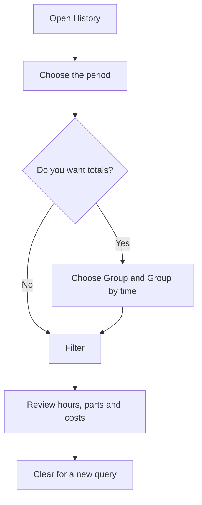

# History

## What this screen is for

Shows the activity recorded on machines (work centers) over a period. Each row is a time segment of a machine: which status it was in, which operator was clocked in, which manufacturing order and phase were loaded, how many good and rejected parts were declared, how many hours it lasted, and how much it cost. The data is generated automatically as operators work on the shop floor; this screen is only for reviewing it, grouping it, and comparing actual cost with the manufacturing order's estimate.

## Available actions

- Choose the "Period" in the filter calendar: first day and last day. It is required.
- Group results with "Group": "Operator", "Work center", "Work order", or "None".
- Group by time with "Group by time": "Day", "Week", "Month", "Year", or "None".
- Run the query with "Filter" and clear the filter and the results with "Clear".
- Sort by the "Work center", "Operator", "Start", "End", "Work order", and "Phase" columns, even by several at once.
- Page through results: 25 rows are shown per page.

## Usual flow

1. Open "History".
2. Choose the period in the calendar.
3. If you want totals, choose a group, for example "Operator", and a time group, for example "Week".
4. Click "Filter".
5. Review the hours, quantities, and costs, and sort by the column you need.
6. Click "Clear" to start a new query.

## Important notes

- Nothing is queried without a period: the "Invalid filter" warning appears.
- A new segment starts every time the machine's status changes, an operator clocks in or out, a phase is loaded, or the shift changes.
- Only finished segments that start and end within the chosen period appear. A machine's current segment does not appear until it closes.
- "Hours" is the segment's duration. If the operator was clocked in on several machines at once, the time is split between them.
- "Operator cost" is the segment's hours times the hourly cost of the operator type, stored when the operator clocked in. "Work center cost" is the hours times the machine's hourly cost for that status, from "Machine costs". "Total cost" is the sum of both.
- Segments with no operator clocked in have an empty "Operator" column and no operator cost.
- "Planned quantity", "Estimated operator cost (per manufacturing order)", and "Estimated work center cost (per manufacturing order)" belong to the whole manufacturing order, not to the segment: they repeat on every row of the same order and must not be added up.
- The "Work order" column shows the manufacturing order's code.
- When grouping, hours, quantities, and actual costs are added up, and "Start" and "End" show the first and last moment of the group. Columns that mix different values show "Various", and the status and phase are left empty. The per-order estimates on a grouped row are those of the group's first row.

## Common errors

- If "Invalid filter" appears with "Select a period", choose both the first and the last day in the calendar.
- If segments from the last moments of the period are missing, extend the period by one day and remember that segments in progress do not appear.
- If "Operator cost" is zero with an operator clocked in, check the "Cost/hour" of their type in "Operator type management". The change only applies to new clock-ins.
- If "Work center cost" is zero, check in "Machine costs" that the machine has a cost for that status.

## Basic process

