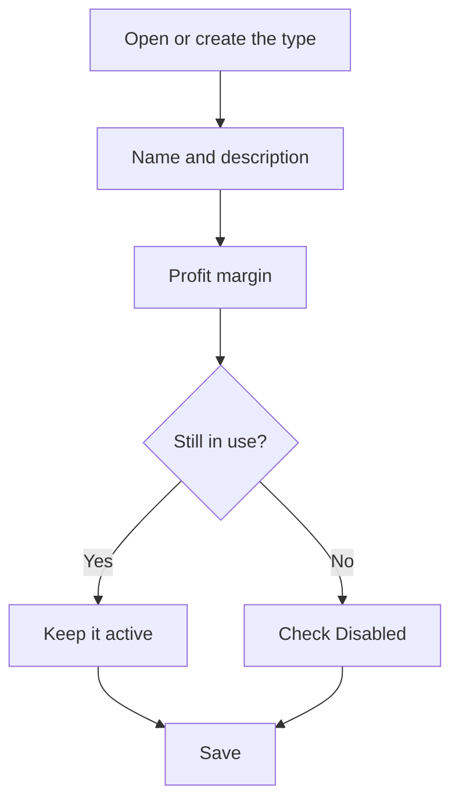

# Machine type

## What this screen is for

This is the record of a machine type. Here you set the name the type shows on machines and phases, and the profit margin proposed by default when a manufacturing route or work order phase runs on this machine type. The title shows "Create machine type" when you create it and "Machine type: " followed by the name when you edit it.

## Available actions

- Enter the "Name" and the "Description", both required.
- Set the "Profit margin" as a percentage.
- Check or clear "Disabled".
- Save with "Save", in the screen header. Saving takes you back to the previous screen.

## Usual flow

1. From "Machine type management", press "+" or open an existing type.
2. Enter a short, recognizable name and a description.
3. Set the usual profit margin for work done on this machine type.
4. Press "Save".
5. Assign the type to machines from "Machine management".

## Important notes

- The type's "Profit margin" is the value proposed when you choose this type in "Type of machine" on a manufacturing route or work order phase. If you then choose a "Preferred machine", the phase may take the machine's margin instead. Changing the margin here does not change phases already saved.
- When creating a type, you cannot reuse the name of another type.
- A type marked as "Disabled" stays in the list but can no longer be chosen for new machines or phases. Machines that already have it keep it.
- Types are deleted from the list; read the "Machine type management" help first, because deleting is permanent.

## Common errors

- If "The name is required" or "The description is required" appears, fill in both fields before saving.
- If "Workcenter type ... already exists" appears, there is already a type with that name: open it from the list instead of creating another one.
- If saving a long name fails, shorten it: a type name can have at most 50 characters.
- If the type does not appear when creating a machine or a phase, check that "Disabled" is not checked.

## Basic process

