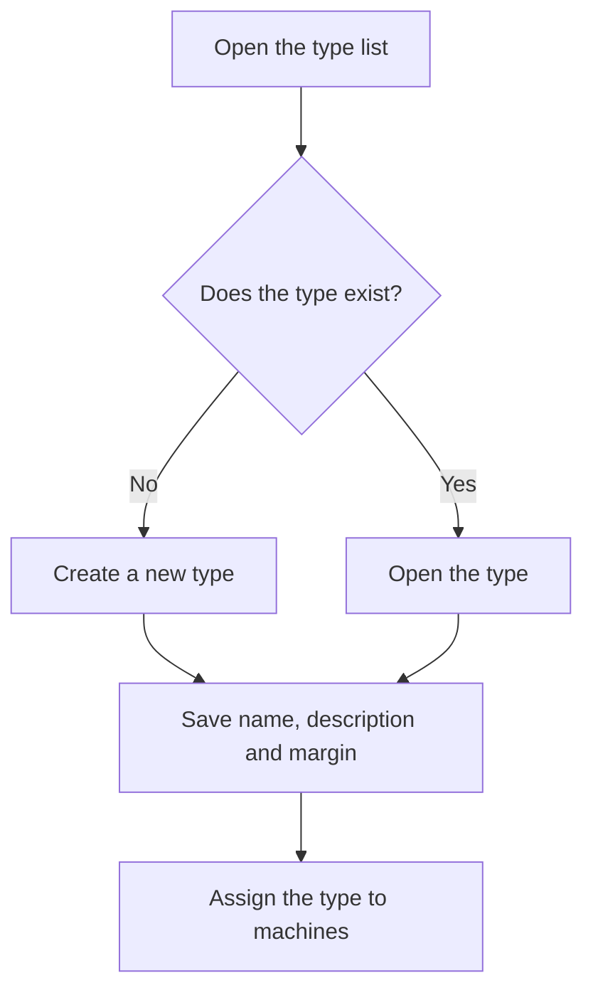

# Machine type management

## What this screen is for

Lists the machine types, the classification that groups machines able to do the same job. Every machine belongs to a type, and the phases of manufacturing routes and work orders state which machine type they must run on. It is the first step of the plant setup: machine type -> machine -> machine costs -> manufacturing route phases.

## Available actions

- Create a new type with the "+" button ("Create new").
- Open a type by clicking its row to change its name, description, margin or status.
- Delete a type with the trash icon ("Delete") on its row, after confirming.
- Check the "Name", "Description", "% Profit" and "Disabled" columns in the table.

## Usual flow

1. Check the list to see whether the type already exists.
2. Press "+" to create a new type.
3. Fill in the name, the description and the profit margin, and save it.
4. Go to "Machine management" and assign this type to the matching machines.
5. When a type is no longer used, open it and mark it as "Disabled".

## Important notes

- The list shows every type, including disabled ones; the "Disabled" column tells them apart. This screen has no filters and the list is sorted by name.
- Disabled types cannot be chosen when creating a machine from "Machine management", nor in the "Type of machine" field of route and work order phases.
- Deleting is permanent: the type is not disabled, it is removed. Machines that have this type are removed with it, so check that it has none before deleting it.
- If the type has already been used, disable it instead of deleting it.
- The fields of the record and the role of the profit margin are explained in the help of the "Machine type" screen.

## Common errors

- If you cannot delete a type, a manufacturing route or work order phase probably uses it: disable it instead.
- If a type does not appear when creating a machine or a phase, check that it is not marked as "Disabled".
- If "Workcenter type ... already exists" appears when creating a type, there is already one with that name: open it from the list.

## Basic process

