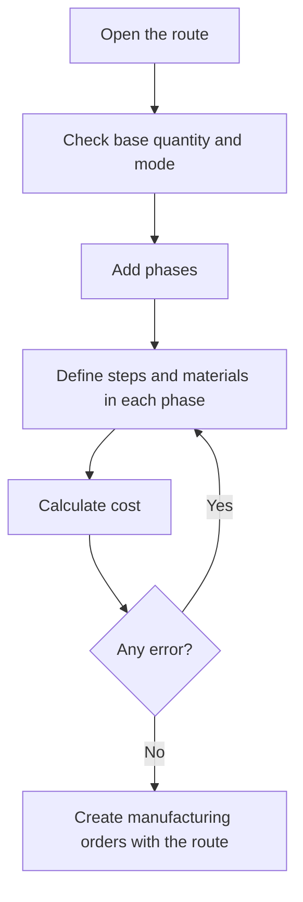

# Manufacturing route

## What this screen is for

This is the screen of a single manufacturing route. Here you define the route's general data (reference, base quantity, volume and mode), the list of phases the part goes through and the resulting theoretical costs. When a manufacturing order is created from this route, its phases, steps and materials are copied into the order.

Flow: `manufacturing route -> phases -> steps and materials -> cost calculation -> manufacturing order`.

## Available actions

- Change "Reference", "Base quantity", "Volume mm3", "Mode" and "Disabled", and save with "Save" in the header.
- Recalculate the costs with "Calculate cost", in the arrow of the "Save" button.
- Check the costs in the "Costs" block: "Operator cost", "Machine cost", "Material cost", "External cost", "Total cost" and "Total weight".
- Add a phase with the + button in "Phases of the route": the "New phase" dialog opens.
- Open a phase by clicking its row to define its steps and materials.
- Delete a phase with the cross on the row, after confirming.

## Usual flow

1. Open the route from "Manufacturing route management" or from the "Manufacturing routes" tab of the sales reference.
2. Check the "Base quantity" and the "Mode" and click "Save".
3. Click + in "Phases of the route", check the proposed code, fill in the machine type, preferred machine and operator type, and click "Save".
4. The phase is created and its screen opens: add its steps and materials.
5. Repeat for each phase, going back to the route with the back button.
6. Click "Calculate cost" and check the result in the "Cost calculation" message and in the "Costs" block.

## Important notes

- When you add a phase, the proposed code is the next ten after the highest phase (10, 20, 30...). A phase cannot be created with a code that already exists in the route.
- Costs are stored on the route. They are recalculated when you click "Save" or "Calculate cost" on this screen; changes to phases, steps or materials do not update them until you save or calculate here again.
- "Save" recalculates silently: if the calculation fails, the route is still saved but the costs keep their previous values. Use "Calculate cost" to see why.
- "Calculate cost" saves the route first and then shows the total cost in a message.
- Costs are calculated for the "Base quantity":
  - "Operator cost": the "Operator time (min)" of each step, converted to hours, times the "Cost/hour" of the phase's "Type of operator".
  - "Machine cost": the "Machine time (min)" of each step, converted to hours, times the cost that the phase's "Preferred machine" has for the step's status in "Machine costs".
  - Steps marked as "Cycle time" are per-part times and are multiplied by the base quantity. The others are a fixed time for the whole batch.
  - "Material cost": for each material, the "Last cost" of the purchase reference times the weight calculated from the dimensions and the density of its material type, times the quantity. If the material's format is by units, it is the "Last cost" times the quantity. Materials without a format add no cost.
  - "Total weight": the sum of the calculated material weights.
  - "External cost": the sum of the "Service cost" and "Transport cost" of the external phases. External phases add no operator, machine or material cost.
- When the route is saved, the total cost is also copied to the reference's "Theoretical manufacturing cost" field.
- A "Disabled" route is not offered to create manufacturing orders or on budget and sales order lines, and it does not show in the reference's "Manufacturing routes" tab.
- When a manufacturing order is created, the route's phases, steps and materials are copied into it. Material quantities are scaled to the planned quantity in proportion to the "Base quantity". Later changes to the route do not change orders that already exist.
- The "Volume mm3" is used to calculate the weight of budget lines that use this route.
- Deleting a phase is permanent: its steps and materials are deleted too.

## Common errors

- If "Calculate cost" says "Workcenter and machine status combination not found", check that every internal phase with steps has a "Preferred machine" and that this machine has a cost for each step status in "Machine costs".
- If it says "Material type not found", a material in one of the phases is a purchase reference without a "Material type".
- If a message (in Catalan) asks for dimensions or density greater than 0 to calculate plates, round bars or tubes, complete the material's dimensions in the phase's "Materials" tab and the density of the material type.
- If adding a phase shows "Invalid phase" because the phase already exists, change the phase code.
- If "The base quantity must be greater than 0" appears, the "Base quantity" must be 1 or more.
- If the "Operator cost" is 0, check that the phases have a "Type of operator" and that the steps have operator time.

## Basic process

