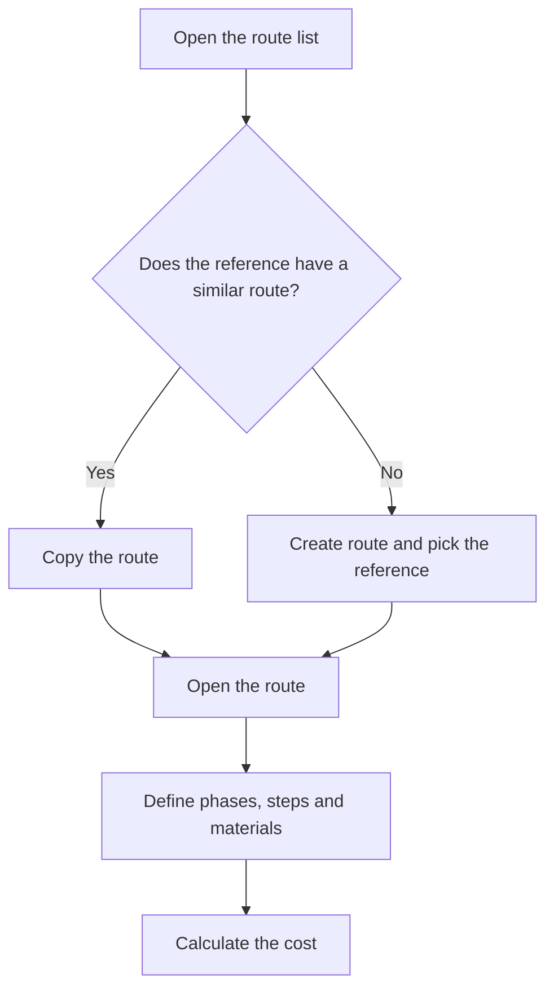

# Manufacturing route management

## What this screen is for

Lists every manufacturing route. A route defines how a sales reference is made: the phases, the steps of each phase with their times, the materials consumed and the resulting theoretical cost. Manufacturing orders are created from a route, and budgets and sales orders use it too.

Flow: `sales reference -> manufacturing route -> manufacturing order -> phases -> part declaration`.

## Available actions

- Create a new route with the "New" (+) button: the "Create route" dialog opens, where you only pick the "Reference".
- Open a route by clicking its row to edit its data, phases and costs.
- Copy a route with the copy icon on the row (or "Copy" in the mobile card view): the "Copy manufacturing route" dialog opens.
- Delete a route with the cross on the row, after confirming.
- Filter the list in "Filters" by "Customer", "Reference" and "Last updated" (date range), and remove the filters with "Clear".

## Usual flow

1. Filter by "Customer" or "Reference" to find the route you need.
2. If the reference has no route yet, click "New", pick the "Reference" and click "Save".
3. The route is created and opens straight away so you can add its phases.
4. If a new reference is made the same way as another one, use the copy icon instead of starting from scratch.
5. In the copy dialog, choose the "Copy destination" and the "Manufacturing mode", then click "Save".

## Important notes

- A new route starts with a base quantity of 1 and the "Prototip" mode. You change these values and the rest of the data on the route screen.
- One reference can have several routes, for example one per mode: "Prototip", "Sèrie curta" and "Sèrie llarga" (the modes show these Catalan names in every language).
- The "Cost" column is the sum of the operator, machine, material and external costs calculated on the route screen. It is not recalculated from this list.
- Copying duplicates every phase, step and material of the source route, and its costs too.
  - With "Existing reference", the new route is assigned to the chosen reference.
  - With "Create new reference", a new reference is created with the given "Code", copying all the data of the source reference. If you leave the "Description" blank, the source description is used.
- When the copy finishes, the list refreshes but the new route does not open.
- The "Customer" filter also shows routes whose reference has no customer. With a customer selected, the "Reference" dropdown only offers that customer's references.
- Filters are remembered when you leave the screen and come back.
- The "Disabled" column marks routes that can no longer be chosen to create manufacturing orders or on budget and sales order lines. They still show here.
- Deleting is permanent: the route is removed with all its phases, steps and materials. If the route has already been used in manufacturing orders, budgets or sales orders, do not delete it: tick "Disabled" on its screen instead.

## Common errors

- If copying to an "Existing reference" says "Reference with manufacturing route for selected mode. Please select another mode", that reference already has a route with the same mode: choose another "Manufacturing mode".
- If the copy does not go ahead and shows "Select a destination reference" or "Enter the new reference code", the required field for the chosen destination option is missing.
- If creating a route shows "The reference is required", pick a reference before saving.
- If you cannot find a route, check the active filters, especially the "Last updated" range, and click "Clear".

## Basic process

