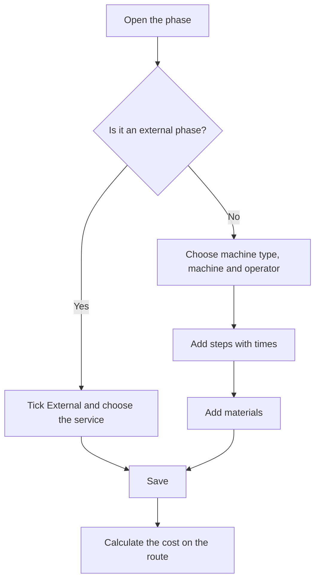

# Manufacturing route - Phase

## What this screen is for

This is the screen of one phase of a manufacturing route. It defines where the phase is done (machine type and preferred machine), who does it (operator type), the profit margin, whether it is external work, the steps with their times and the materials it consumes. This data feeds the route's cost calculation and is copied into the phases of the manufacturing orders created with the route.

Flow: `manufacturing route -> phase -> steps and materials -> manufacturing order -> loading on the machine`.

## Available actions

- Change the phase header: "Phase code", "Description", "Type of machine", "Preferred machine", "Profit margin", "Type of operator", "External", "Service", "Service cost" and "Transport cost", and save with "Save".
- Manage the steps in the "Steps" tab: + to add one ("Add manufacturing step"), click a row to edit it and the cross to delete it.
- Manage the materials in the "Materials" tab: + to add one ("Add material"), click a row to edit it and the cross to delete it.

## Usual flow

1. Open the phase from "Phases of the route" (it also opens by itself right after you create it).
2. Choose the "Type of machine", then the "Preferred machine", check the "Profit margin", choose the "Type of operator" and click "Save".
3. In "Steps", click + and fill in "Order", "Status", "Cycle time", "Machine time (min)", "Operator time (min)" and, if needed, "Manufacturing comment". Repeat for each step.
4. In "Materials", click + and choose the "Material", the "Quantity" and the dimensions its format needs.
5. Go back to the route and click "Calculate cost" to update its costs.

## Important notes

- Changing the "Type of machine" clears the "Preferred machine" and proposes the machine type's margin. The "Preferred machine" only offers machines of that type.
- When you choose the "Preferred machine", the "Profit margin" is proposed as follows: if the machine has percentages in its "Percentages" tab, the field becomes a dropdown with those values; otherwise the machine's margin is used and, if it is 0, the machine type's margin. In all other cases the field is read-only.
- The "Profit margin" is the margin proposed for this phase when the route is used on a budget or sales order line.
- Ticking "External" clears the machine type, preferred machine and operator type, and proposes the external work margin of the current fiscal year. "Service", "Service cost" and "Transport cost" become editable. Unticking it resets those three fields and the margin to zero.
- "Service" offers the purchase references of the service category. Choosing one fills "Service cost" and "Transport cost" with the service's price and transport amount.
- In an external phase, the route cost only counts the "Service cost" and "Transport cost": the phase's steps and materials add no cost. If the phase has a "Service", budgets that use the route add that external service.
- A new step's order is proposed as the next ten (10, 20, 30...).
- Each step is a machine status with an expected time. On the plant floor, the steps of the manufacturing order's phase are the activities the operator can load on the machine, and their times are compared with the real ones.
- With "Cycle time" ticked, the step times are per part and are multiplied by the quantity. Unticked, they are a fixed time for the whole batch.
- When a step is saved, the system checks that every machine of the phase's "Type of machine" has a cost for the chosen status in "Machine costs".
- The "Material" dropdown offers purchase references. The "Quantity" refers to the route's base quantity; when a manufacturing order is created it is scaled to the planned quantity.
- The dimensions required depend on the material's format: a plate needs width, height and length; a round bar, diameter and length; a tube, diameter, thickness and length. A material by units needs no dimensions. The material type must also have a density.
- When you add, edit or delete a step or a material, pending changes to the phase header are saved too.
- Changes on this screen do not update the route's costs until you save or calculate on the route again.
- Changing the "Phase code" here is not checked against the other phases of the route: avoid repeating codes.
- Deleting a step or a material is permanent.

## Common errors

- If saving a step shows "Workcenter cost not found", a machine of the phase's machine type has no cost for that status: add it in "Machine costs" or choose another status.
- If the "Preferred machine" list is empty, choose the "Type of machine" first.
- If "Service", "Service cost" and "Transport cost" cannot be edited, tick "External".
- If the step is not saved, check the messages "The order is required", "The order must be positive" or "The estimated time is required".
- If the material is not saved, check "The consumable material is required" or "The quantity to consume must be positive": the quantity must be 1 or more.
- If the route's cost calculation later fails because of dimensions or density, complete the material's dimensions here according to its format.

## Basic process

