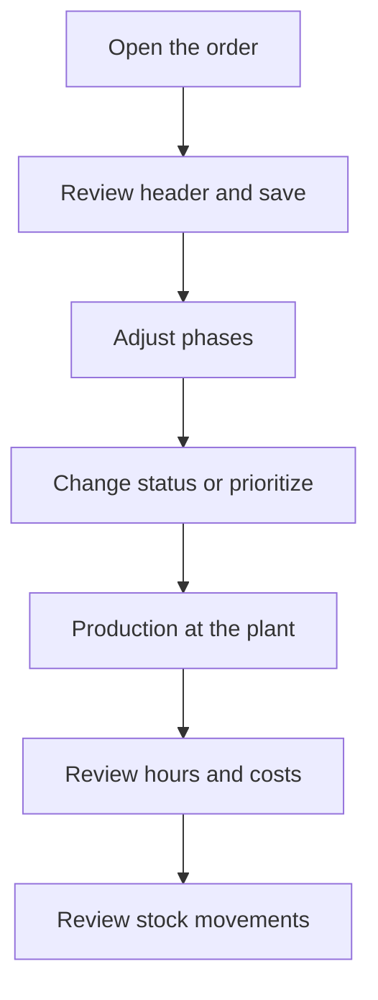

# Manufacturing order

## What this screen is for

This is the record of a manufacturing order. The header holds the reference, the expected quantity and date, the status, the priority, and the execution period. The tabs show the phases to be done, the hours declared in production tickets, the accumulated costs, and the order's stock movements. It sits between the manufacturing route (where the phases come from) and the plant, where the phases are produced.

## Available actions

- Save the header with "Save".
- Download the order sheet from the arrow next to "Save": "Download Excel" or "Download PDF".
- Change the order status in the "Status" field.
- "Phases" tab: add a phase with the "+" button ("New phase" dialog), open a phase by clicking its row, and delete it with the cross.
- "Hours" tab: review the order's production tickets, filter them by operator, machine, phase, or date, add one with "+" ("Create production ticket" dialog), and delete it with the cross.
- "Costs" tab: review "Operator cost", "Machine cost", "Material cost", "Total cost", "Operator time", and "Machine time".
- "Movements" tab: review the order's stock movements (date, reference, location, dimensions, type, quantity, and description).

## Usual flow

1. Open the order from "Manufacturing orders" or from the sales order line.
2. Check the "Expected date", "Expected quantity", and "Priority", then press "Save".
3. In "Phases", review the phases copied from the route; add phases or open one to adjust its steps and materials.
4. Change the "Status" when the order is ready for the plant, or prioritize it from "Prioritize manufacturing orders".
5. While it is being produced, follow progress in "Phases" (good / bad pieces) and "Hours".
6. When it is finished, review "Costs" and "Movements" to validate the actual cost and the stock entry.

## Important notes

- "Code", "Reference", and "Total quantity" cannot be edited. "Total quantity" adds up the pieces from the production tickets and, when the last phase is finished at the plant, becomes the good pieces of that phase.
- The "Status" dropdown only offers the statuses you can move to from the current one, according to the transitions defined in "Lifecycles". Status names appear as they are defined there.
- Changing the status on this screen does not create tickets or stock movements. Those effects happen when phases are finished at the plant.
- The plant updates the order automatically: when a phase starts, the order moves to "Producció" and the start of the "Execution period" is recorded; when the last phase finishes, the order takes the chosen status, the end is recorded, and a single production stock entry is created with the good pieces in the warehouse's default location. If the next phase is external, the order moves to "Servei Extern".
- An external phase closes by itself when the whole purchase order for its service has been received; if it is not the last phase, the order moves to "Pausa", and if it is, the order becomes "Tancada" with its stock entry.
- Operator and machine costs accumulate with each production ticket (time in minutes × hourly cost / 60). The material cost is recalculated from the phases' stock consumptions when a phase is finished at the plant.
- When you save the order, the "Total cost" is copied to the reference's "Last Manufacturing / Purchase Cost" and to the last cost of the linked sales order lines.
- If you change the "Expected quantity", the material quantities of the phases are not recalculated: review them in each phase.
- In "Hours", the cross deletes the ticket immediately, without confirmation, and subtracts its hours, pieces, and costs from the order.
- Deleting a phase (with confirmation) also deletes its steps, materials, rejections, and production tickets.
- When you create a ticket from this screen, you first choose "Manufacturing Order | Phase | Activity" and then the "Machine": only machines of the phase's machine type are listed.
- A new phase proposes the next ten (10, 20, 30...) as its code and the lifecycle's initial status. Saving it opens its record.

## Common errors

- If you cannot save, check the messages "The expected date is required", "The quantity must be greater than 0", and "The order is required" ("Priority" field).
- If the status you need is not in the dropdown, check the current status's transitions in "Lifecycles".
- If "Invalid phase" appears when adding a phase, the code already exists in this order: change it.
- If creating a ticket shows "You must enter the machine time and it must be greater than 0", fill in "Total work center time (minutes)".
- If there are no machines to choose when creating a ticket, the phase has no machine type or there are no machines of that type.
- If a ticket has a machine cost of 0, check in "Machine costs" that the machine has a cost for the step's machine status.
- If the download shows "The manufacturing order report could not be generated", try again and, if it persists, tell your administrator.

## Basic process

