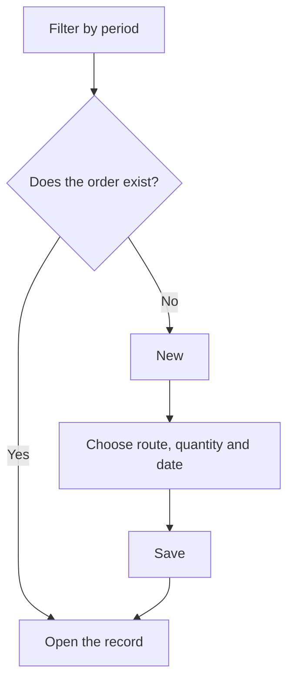

# Manufacturing orders

## What this screen is for

This is the list of all manufacturing orders. Here you find the orders for a period, create a new order from a manufacturing route, and open each order's record. It fits into the flow `manufacturing route -> manufacturing order -> phases -> production tickets`. Manufacturing orders can also be created from a sales order line.

## Available actions

- Filter the list with "Filters": "Period", "Customer", "Code", and "Status", then apply them with "Filter".
- Return to the initial filters with "Clear".
- Create a new order with "New", which opens the "Create order" dialog.
- Open an order's record by clicking its row.
- Delete an order with the cross on its row, after confirming.
- Sort by "Expected date" and adjust the view with "View configuration".

## Usual flow

1. Check the filter's "Period": by default it is the fiscal year for the current year.
2. Filter by "Customer", "Code", or "Status" if needed and press "Filter".
3. To create an order, press "New".
4. Choose the "Route", enter the "Quantity" and the "Expected date" and, optionally, the "Manufacturing comment".
5. Save: the new order's record opens straight away.
6. From the record, review phases, materials, and priority before releasing it to the plant.

## Important notes

- The "Period" is required and filters by the order's expected date, not its creation date.
- Filters are saved per user when you leave the screen; "Clear" removes them and goes back to the current year's fiscal year.
- The creation dialog only lists active manufacturing routes. Each option shows the reference, the route's base quantity, and the mode.
- When the order is created, its code is generated automatically from the counter of the fiscal year that matches the "Expected date".
- The order starts in the initial status of the manufacturing order lifecycle ("Creada") and copies the route's phases, steps, and materials. Each material quantity is scaled by the order quantity relative to the route's base quantity. Status names appear as they are defined in "Lifecycles".
- Later changes to the route do not affect orders that already exist.
- If the route's reference works with lots, a "Lot code" field appears. Depending on the system configuration, the lot automatically takes the order code (and the field is ignored), or you must enter it.
- From a sales order line, the same dialog opens with the route, the line quantity, and the order's expected date proposed, and the line is linked to the manufacturing order.
- Deletion is permanent: it removes the order with its phases and production tickets, and unlinks the related sales order line.

## Common errors

- If "Invalid filter" appears, select a complete period (start and end date).
- If you cannot save the dialog, check the messages: "The manufacturing route is required", "The quantity must be greater than 0", or "The expected date is required".
- If creation fails saying no fiscal year was found, check in "Fiscal years" that one covers the "Expected date".
- If a lot code is requested, fill in "Lot code": the reference works with lots and the system does not generate it automatically.
- If a route is missing from the list, check in "Manufacturing route management" that it is active.
- If you cannot delete an order that has already been worked on at the plant, it may have plant records or linked documents that prevent it.

## Basic process

