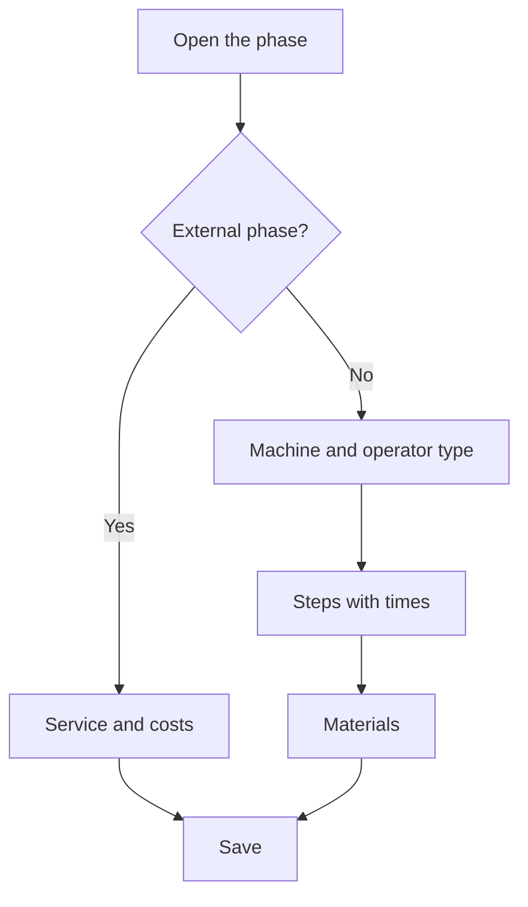

# Manufacturing order - Phase

## What this screen is for

This is the record of one phase of a manufacturing order. It defines where and how the phase is done (machine type, preferred machine, operator type, or external service), the steps with estimated times per machine status, and the materials it consumes. It also shows the comments and rejections recorded at the plant. Phases are copied from the manufacturing route when the order is created and can be adjusted here for this order.

## Available actions

- Save the phase header with "Save".
- Change the phase status in the "Status" field.
- "Steps" tab: add a step with "+" ("Add manufacturing step"), edit it by clicking its row ("Edit manufacturing step"), and delete it with the cross.
- "Materials" tab: add a material with "+" ("Add material"), edit it by clicking its row, and delete it with the cross.
- "Comments" tab: read the "Phase comment" written at the plant.
- "Rejections" tab: review the rejected pieces by reason, with the total of rejected units.

## Usual flow

1. Open the phase from the order's "Phases" tab.
2. Check the "Type of machine", "Preferred machine", "Profit margin", and "Type of operator", or tick "External" if a supplier does the phase.
3. In "Steps", make sure there is a step for each machine status that will be used (for example setup and production) with its estimated times.
4. In "Materials", adjust the material and the quantity to be consumed.
5. Press "Save".
6. During and after production, check "Comments" and "Rejections".

## Important notes

- The "Type of machine" decides which machines can load the phase at the plant and which machines can be chosen in a production ticket.
- Changing the "Type of machine" clears the "Preferred machine" and sets the "Profit margin" to the type's margin. Choosing a preferred machine sets the margin to the machine's margin if it has one; otherwise, to the type's.
- Ticking "External" clears the machine type, preferred machine, and operator type, and enables "Service", "Service cost", and "Transport cost". Choosing the service copies its price and transport cost. Unticking it sets those costs to zero.
- External phases with a service can be turned into a purchase order from "Purchase order generation". When the whole purchase order has been received, the phase closes automatically.
- The phase status follows the same lifecycle as the order, and the dropdown only offers the transitions allowed from the current status. The plant normally changes the status when it loads and finishes the phase.
- Each step matches a machine status. If "Cycle time" is ticked, the machine time is per piece and is multiplied by the order quantity; otherwise, it is the total time of the step.
- When the phase is finished at the plant, the time worked is turned into production tickets for each machine status that has a step in the phase. Time spent in statuses without a step does not create a ticket.
- A new step proposes the next ten as its order; the order must be positive.
- Adding, editing, or deleting a step or a material also saves any pending changes in the phase header.
- "Comments" and "Rejections" are read-only: they are recorded from the plant machine.

## Common errors

- If you cannot save the header, check "The code is required" and "The status is required".
- If you cannot save a step, check "The order is required", "The order must be positive", and "The estimated time is required".
- If you cannot save a material, check "The consumable material is required" and "The quantity to consume must be positive".
- If "Service", "Service cost", or "Transport cost" are disabled, tick "External" first.
- If "Preferred machine" has no options, choose a "Type of machine" first.
- If the phase does not appear at the plant, check the phase's "Type of machine" and the order status.

## Basic process

