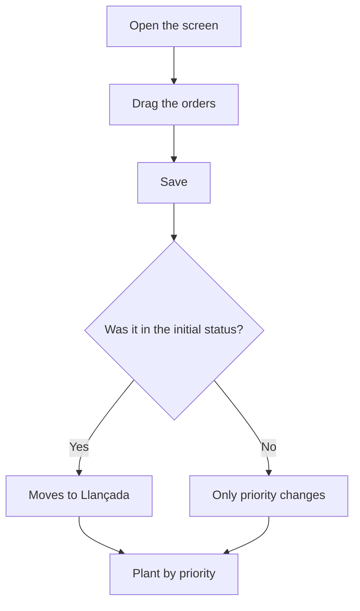

# Prioritize manufacturing orders

## What this screen is for

This screen decides the order in which pending manufacturing orders should be produced. Dragging the rows sets each order's "Priority", which is the order in which the plant sees them in "Available phases". It is also used to release newly created orders.

## Available actions

- Drag a row by the handle on the left to change its position.
- Save the new order with the save button (floppy disk icon) in the table's top bar.
- Open a manufacturing order by clicking its "Code".

## Usual flow

1. Open the screen: orders are sorted by "Priority" and then by "Planned date".
2. Drag the orders into the sequence in which they should be produced.
3. Press the save button.
4. Check the "Manufacturing orders updated" message.
5. If needed, open an order from its "Code" to review it.

## Important notes

- Only orders in statuses marked with the "Available" tag of the manufacturing order lifecycle, in "Lifecycles", are listed. If no status has that tag, only orders in the initial status are listed.
- When you drag, the "Priority" is renumbered 1, 2, 3... by position in the list. Nothing is saved until you press the save button.
- When you save, orders that were in the lifecycle's initial status (usually "Creada") move to "Llançada". The others only change priority. Status names appear as they are defined in "Lifecycles".
- The plant lists orders in "Available phases" by priority and then by expected date, as long as the order status has the "Plant" tag.
- The priority can also be changed by hand in the "Priority" field of the order record.
- This screen has no filters and cannot create or delete orders: use "Manufacturing orders" for that.

## Common errors

- If an order is missing from the list, check its status and that the status has the "Available" tag in "Lifecycles".
- If an error appears when saving, reload the screen and repeat the sorting: one of the orders may have been deleted in the meantime.
- If a prioritized order does not appear at the plant, check that its status has the "Plant" tag.
- If you leave without saving, the new sequence is lost.

## Basic process

