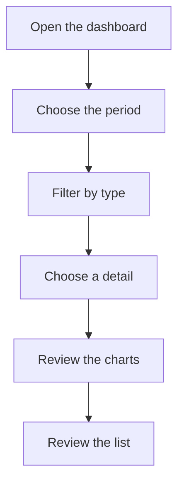

# Expense dashboard

## What this screen is for

Summarizes everything the company has to pay in a period by adding up two sources: the expenses from "Expense management" (by payment date) and the due dates of purchase invoices (by due date). It shows the total amount, the month-by-month trend and the split by expense type or by supplier, with the detail in a list.

## Available actions

- Choose the "Period"; by default it is the current year.
- Filter by "Type": "Purchase" (purchase invoice due dates) or "Expense" (general expenses).
- Filter by "Detail": a specific expense type or supplier, among those shown in the chart by type.
- Check the "Charts" tab: "Monthly grouped expenses" (bars per month) and "Expense chart by type" (pie).
- Check the "List" tab: one row per expense or due date, with type, detail, payment date, amount and description.
- Clear the filters with the "Clear filters" button in the filter bar.

## Usual flow

1. Open "Expense dashboard" and check the "Total expense" for the current year.
2. Adjust the "Period" for another range; the dashboard refreshes by itself once both dates are chosen.
3. Choose a "Type" to see only purchases or only expenses.
4. Use the chart by type to see which expense types or suppliers weigh most and, if needed, pick one in "Detail".
5. Switch to "List" to see the individual items that make up the total.

## Important notes

- "Total expense" is the sum of the amounts of every item that matches the filters, the same items shown in "List".
- For purchases, the amount is that of each invoice due date and the date is the due date, not the invoice date. All purchase invoices are counted, whatever their status.
- In "Detail", purchases are grouped by the supplier's legal name and expenses by the expense type name.
- Recurring expenses appear once for each generated payment.
- If you record as an expense a payment that also comes in as a purchase invoice, the dashboard counts it twice.
- Changing the "Type" empties the "Detail" filter. The "Detail" options are the labels the chart by type is showing at that moment.
- This dashboard is read-only: it does not create or change anything.

## Common errors

- If the dashboard does not change when you choose the period, check that you picked both the start and end dates.
- If the charts do not change after clearing the filters, choose a "Period" again: without a period the data is not reloaded.
- If a purchase invoice is missing, check that it has due dates and that the due date falls within the period.
- If an expense is missing, check its payment date in "Expense management".

## Basic process

