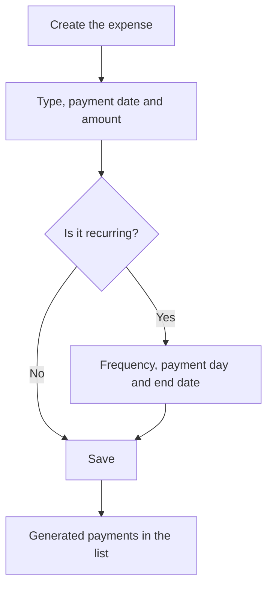

# Expense

## What this screen is for

This is the form of a general expense: a payment the company records outside purchase invoices, classified by type. It opens when you create an expense from "Expense management" ("New expense") or open an existing one ("Edit expense"). If the expense repeats, you set here how often and until when, and the application generates the future payments.

## Available actions

- Choose the expense "Type" and fill in the "Creation date", "Payment date" and "Amount".
- Tick "Recurring" to enable "Frequency", "Payment day" and "End date".
- Write a "Description".
- Save with "Save", in the screen header.

## Usual flow

1. From "Expense management", press "+".
2. Choose the "Type" and fill in the "Payment date" and "Amount".
3. For a periodic payment, tick "Recurring" and choose the "Frequency" (monthly, every two months, quarterly, half-yearly or yearly), the "Payment day" and the "End date".
4. Add a "Description" that identifies the payment.
5. Press "Save": you go back to the list, which now shows the expense and, if it is recurring, the generated payments.

## Important notes

- "Type", "Creation date", "Payment date" and "Amount" are required. Types are maintained in "Expense type management".
- The "Payment date" is the one that counts in the list and on the "Expense dashboard".
- When you create a recurring expense, the application generates a new payment for each "Frequency" period, with the same type, amount and description, until it reaches the "End date". The last payment may fall on the end date or just after it.
- Set the "Payment day" to the same day of the month as the "Payment date". If they differ, each generated payment shifts a few more days than the previous one.
- Be careful when editing a recurring expense: on saving, the whole series is deleted, including the expense you are editing, and only the payments after its payment date are generated again. Check the list after saving; if you need to change the amount or dates of the whole series, it is usually cleaner to delete it and create it again.
- Deleting a recurring expense from the list deletes the whole series.

## Common errors

- If "Save" does nothing, check the red messages: the type, a date or the amount is missing.
- If the "Type" dropdown is empty, go back to "Expense management" and open the expense from the list, which is what loads the types.
- If you ticked "Recurring", always fill in the "Frequency" and the "End date": the form does not require them, but without them the payments are not generated correctly.
- If payments are missing from the list after editing a recurring expense, that is the effect of regenerating the series: create it again with the correct dates.

## Basic process

